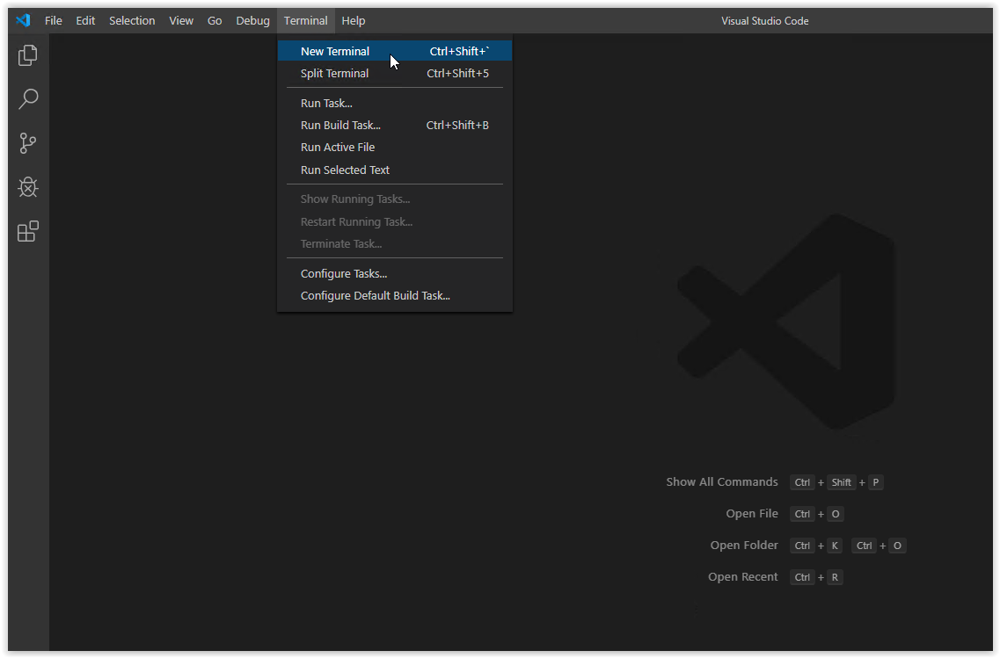
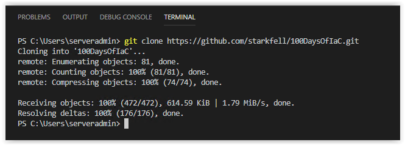
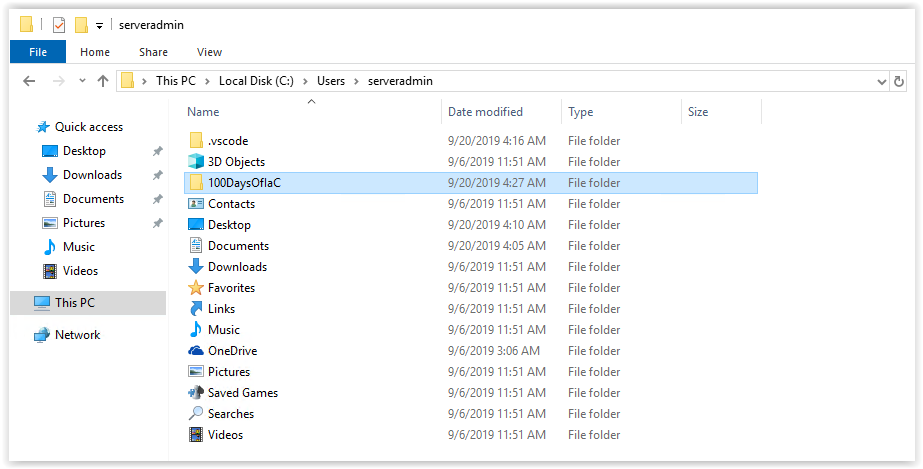
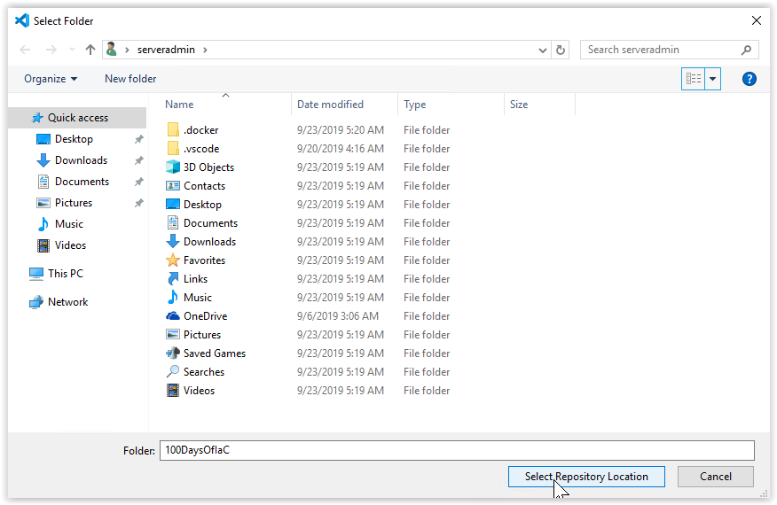
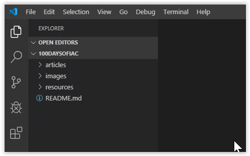
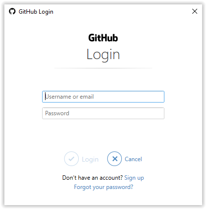
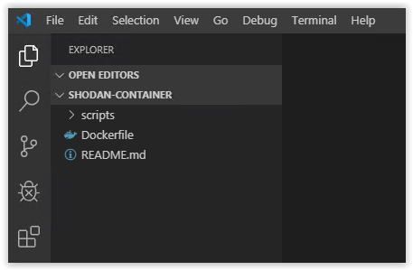
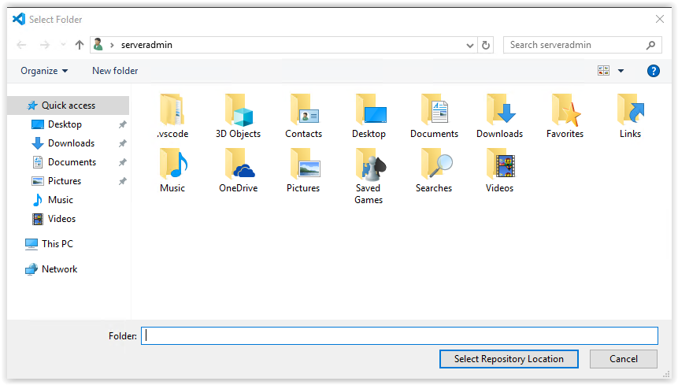
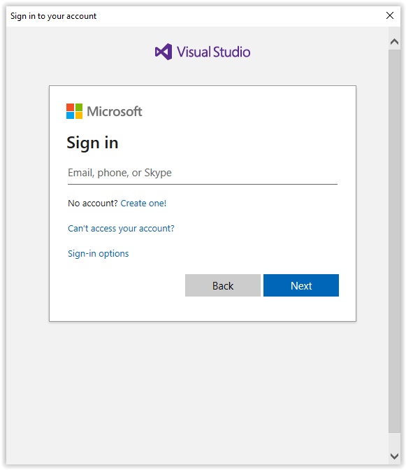
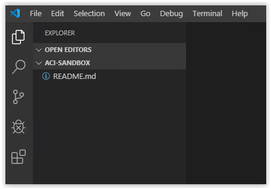

# Day 13 - GIT Started in VS Code (Windows Edition)

To get started to using Git with either GitHub or Azure DevOps, we are going to go over the options available to you to connect and clone repositories in either service using Visual Studio Code. Additional articles about using Git in VS Code will be coming in the near future.

> **NOTE:** This article was tested and written for a Windows Host running Windows 10.

<br />

In this installment, we'll be going over the following.

[What is Git](#what-is-git)<br />
[Why is Git important for IaC](#why-git-is-important-for-iac)<br />
[Installing Git using Chocolatey](#install-git-using-chocolatey)<br />
[Clone a Public GitHub Repo in VS Code using the Terminal](#clone-a-repo-in-vs-code-using-the-terminal))<br />
[Clone a Public GitHub Repo using VS Code in the Control Pallet](#clone-a-repo-using-the-control-pallet)<br />
[Clone a Private GitHub Repo in VS Code ](#clone-a-private-github-repo-in-vs-code-using-the-control-pallet)<br />
[Clone a Private Azure DevOps Repo in VS Code](#clone-a-private-azure-devops-repo-in-vs-code)<br />
[Conclusion](#conclusion)

<br />

## What is Git

Git is a versioning control system that allows you to track changes to anything you are working on (Code, Documentation, files, images, etc...) under a single primary directory called a repository. However, a much more colorful description is given by its creator Linux Torvalds (also the creator of Linux) at the top of the **[README](github.com/git/git/blob/e83c5163316f89bfbde7d9ab23ca2e25604af290/README)** file in the initial revision of Git.

```markdown
     GIT - the stupid content tracker

"git" can mean anything, depending on your mood.

 - random three-letter combination that is pronounceable, and not
   actually used by any common UNIX command.  The fact that it is a
   mispronounciation of "get" may or may not be relevant.
 - stupid. contemptible and despicable. simple. Take your pick from the
   dictionary of slang.
 - "global information tracker": you're in a good mood, and it actually
   works for you. Angels sing, and a light suddenly fills the room.
 - "goddamn idiotic truckload of sh*t": when it breaks

This is a stupid (but extremely fast) directory content manager.  It
doesn't do a whole lot, but what it _does_ do is track directory
contents efficiently.
```

That last sentence describing how it tracks directory contents extremely fast and efficiently is the crux of why Git is so popular.

<br />

## Why Git is important for IaC

IT is not uncommon for people in IT to utilize scripts, written in a variety of scripting languages, to automate redundant tasks they perform on a regular basis. Sometimes these scripts are documented as to how they work and what their purpose is, many times they are not. As they collection of scripts grows over time, variations of the same script may be written without any meaningful way of distinguishing them. Lastly, tracking changes made to these scripts is a manual process that is left up to their maintainers.

If you were to use this same methodology while adopting Infrastructure as Code you would be setting yourself up for failure. This is why using a version controlling system such as Git is so important.

With Git any changes made to a repository must be first be done to the local copy on your machine, committed as a change that can include comments as to the change, and then pushed to the master version of the repository wherever it is hosted (GitHub, AzureDevOps, Bitbucket, etc). This process ensures that any changes made to the repository are trackable and accountable.

<br />

## Install git using Chocolatey

Open up an Elevated PowerShell prompt and run the following command to install Git using Chocolatey

```powershell
choco install git -y
```

<br />

## Clone a Public GitHub Repo in VS Code using the Terminal

Open up Visual Studio Code and click on Terminal and then New Terminal.



Next, clone the 100DaysofIac Repo using HTTPS, by running the following command in the terminal.

```powershell
git clone https://github.com/starkfell/100DaysOfIaC.git
```

You should get back the following response as shown below.



You'll notice that the 100DaysOfIaC Repository has been downloaded into a directory in your User Directory.



<br />

## Clone a Public GitHub Repo using the Control Pallet

In VS Code, press CTRL + Shift + P to open up the control pallet

Type in Git until you see **Git:Clone** and click on it.


Copy and paste in the 100DaysofIaC URL into the prompt and press Enter.


You should see the contents of your User Folder appear, click on the **Select Repository Location** button.

> **NOTE:** If you see the 100DaysOfIaC Folder from the previous example, delete it first.



In the bottom right hand corner of VS Code, you will be prompted to open the cloned directory. **Click Open**.


In the upper left hand corner of VS Code, you should see the contents of the **100DaysOfIaC** repository in the Explorer window.



<br />

## Clone a Private GitHub Repo in VS Code

*You need access to a GitHub Account and an existing Private repository in GitHub to complete the next steps. Setting up a new GitHub account and creating your own private repo takes only a few minutes, you can start **[here](https://github.com/join).***

In VS Code, press **CTRL + Shift + P** to open up the control pallet

Type in Git until you see **Git:Clone** and click on it.


Copy and paste in the URL of the Private Repo into the prompt and press Enter.


You should see the contents of your User Folder appear, click on the **Select Repository Location** button.


Next, you will be prompted to login to GitHub.



If you are setup with two-factor authentication, you will be prompted again.


In the bottom right hand corner of VS Code, you will be prompted to open the cloned directory. **Click Open**.


In the upper left hand corner of VS Code, you should see the contents of the private repository in the Explorer window.



<br />

## Clone a Private Azure DevOps Repo in VS Code

*You need to have access to an existing Microsoft account and a repository already setup before you can complete the steps below. You can sign-up for an account **[here](https://azure.microsoft.com/en-us/services/devops/)**.*

In VS Code, press **CTRL + Shift + P** to open up the control pallet

Type in Git until you see **Git:Clone** and click on it.


Copy and paste in the URL of the Private Repo into the prompt and press Enter.


You should see the contents of your User Folder appear, click on the **Select Repository Location** button.



Next, you will be prompted to login using your Microsoft Account.



> **NOTE:** If you are setup with two-factor authentication, you will be prompted again.

In the bottom right hand corner of VS Code, you will be prompted to open the cloned directory. **Click Open**.


In the upper left hand corner of VS Code, you should see the contents of the private repository in the Explorer window.



## Conclusion

In the next few installments we'll be covering additional information on working with Git and how you can get manage and deploy ARM templates from within VS Code. In the meantime, we highly recommend reading the first three chapters of the **[Pro Git Book](https://git-scm.com/book/en/v2)** by Scott Chacon and Ben Straub.
