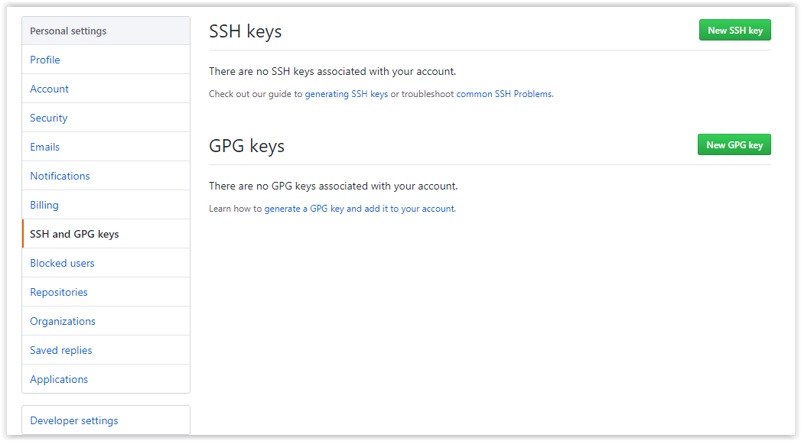
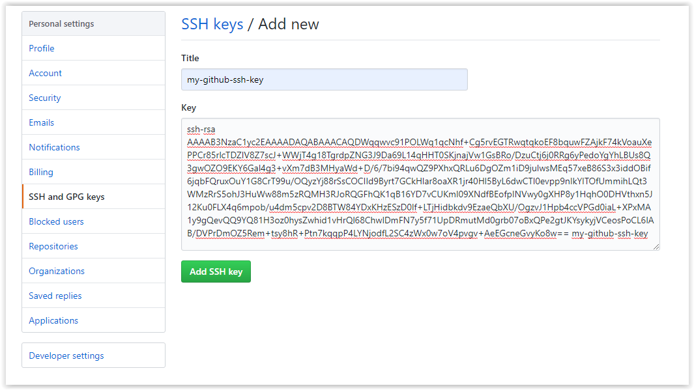
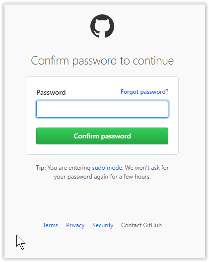
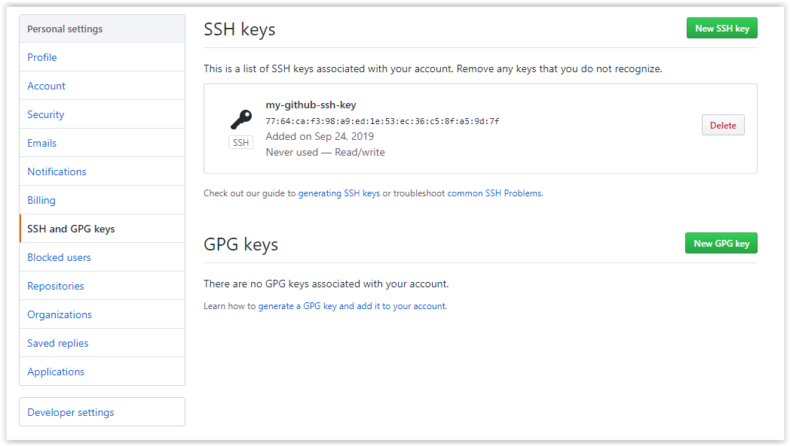
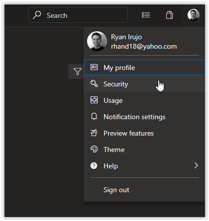
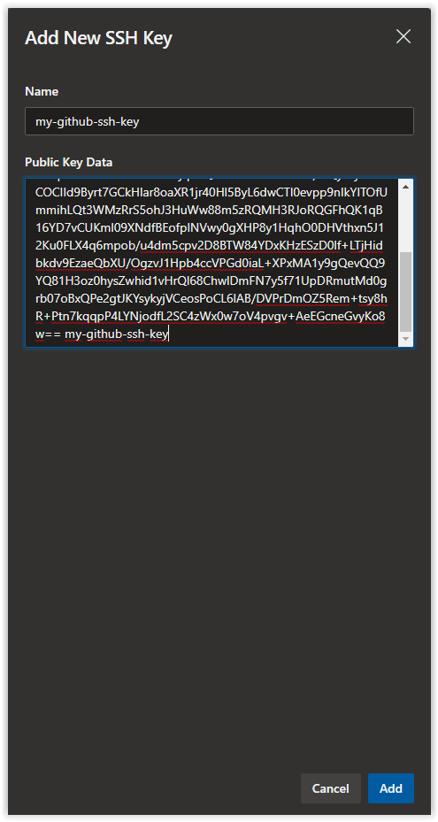

# Day 14 - GIT Started in Linux

Since we created an article of how to **[GIT Started in VS Code in Windows](day.13.git.started.in.vs.code.windows.edition.md)**, we decided to include an article of how to clone private and public repositories on a Linux host from a bash prompt. Additionally, we will be generated an SSH Key Pair and adding the public key to a GitHub and Azure DevOps account for authentication.

*WARNING!: The SSH Key Pair that is used in this article is used for both the GitHub Account and the Azure DevOps Account and doesn't require a password. If you were doing this in a Production environment, it would be advisable to password protect the Private Key and use separate SSH Key Pairs for authentication in GitHub and Azure DevOps.*

> **NOTE:** This article was tested and written for a Linux Host running Ubuntu 18.04.

<br />

In this installment, we'll be going over the following.

[Installing Git on Ubuntu](#installing-git-on-ubuntu)<br />
[Clone a Public GitHub Repo ](#clone-a-public-github-repo)<br />
[Clone a Private GitHub Repo using SSH Keys](#clone-a-private-github-repo-using-ssh-keys)<br />
[Clone a Private Azure DevOps Repo using SSH Keys](#clone-a-private-azure-devops-repo)<br />
[Conclusion](#conclusion)

<br />

## Installing Git on Ubuntu

From a bash prompt, run the following command to install Git.

```bash
sudo apt-get install git -y
```

<br />

## Clone a Public GitHub Repo

Next, run the following command to clone the **100DaysofIaCRepo** from GitHub.

```bash
git clone https://github.com/starkfell/100DaysOfIaC.git
```

You should get back the following response:

```console
Cloning into '100DaysOfIaC'...
remote: Enumerating objects: 4, done.
remote: Counting objects: 100% (4/4), done.
remote: Compressing objects: 100% (4/4), done.
remote: Total 574 (delta 0), reused 3 (delta 0), pack-reused 570
Receiving objects: 100% (574/574), 1.31 MiB | 2.73 MiB/s, done.
Resolving deltas: 100% (215/215), done.
```

<br />

## Clone a Private GitHub Repo using SSH Keys

*You need access to a GitHub Account and an existing Private repository in GitHub to complete the next steps. Setting up a new GitHub account and creating your own private repo takes only a few minutes, you can start **[here](https://github.com/join).***

In this section we will generate an SSH Key Pair, add the public key to GitHub and use it to clone a private repository locally.

<br />

### Generate SSH Keys

From a bash prompt, run the following command to create an SSH Key Pair.

```bash
ssh-keygen \
-t rsa \
-b 4096 \
-C "my-github-ssh-key" \
-f ~/.ssh/my-github-ssh-key -N ''
```

You should get back a response similar to what is shown below:

```console
Generating public/private rsa key pair.
Created directory '/home/serveradmin/.ssh'.
Your identification has been saved in /home/serveradmin/.ssh/my-github-ssh-key.
Your public key has been saved in /home/serveradmin/.ssh/my-github-ssh-key.pub.
The key fingerprint is:
SHA256:VK26Xp0+mSaO5PTK3r7JRJBwUhZjbo9KOF7UmsDfVrE my-github-ssh-key
The key's randomart image is:
+---[RSA 4096]----+
|      o.B.o.     |
|   .   O + o.    |
|    o . B E.     |
|     = * =.      |
|    o * S.o      |
|   . + o.. . .   |
|    . . o.o oo   |
|       =.B.o=    |
|       oB+O+..   |
+----[SHA256]-----+
```

**cat** out the SSH Public Key.

```bash
cat ~/.ssh/my-github-ssh-key.pub
```

You should get back something similar to what is shown below. Copy and save it for use in the next couple of sections.

```console
ssh-rsa AAAAB3NzaC1yc2EAAAADAQABAAACAQDWqqwvc91POLWq1qcNhf+Cg5rvEGTRwqtqkoEF8bquwFZAjkF74kVoauXePPCr85rlcTDZlV8Z7scJ+WWjT4g18TgrdpZNG3J9Da69L14qHHT0SKjnajVw1GsBRo/DzuCtj6j0RRg6yPedoYgYhLBUs8Q3gwOZO9EKY6Gal4g3+vXm7dB3MHyaWd+D/6/7bi94qwQZ9PXhxQRLu6DgOZm1iD9julwsMEq57xeB86S3x3iddOBif6jqbFQruxOuY1G8CrT99u/OQyzYj88rSsCOCIId9Byrt7GCkHlar8oaXR1jr40Hl5ByL6dwCTl0evpp9nIkYITOfUmmihLQt3WMzRrS5ohJ3HuWw88m5zRQMH3RJoRQGFhQK1qB16YD7vCUKml09XNdfBEofpINVwy0gXHP8y1HqhO0DHVthxn5J12Ku0FLX4q6mpob/u4dm5cpv2D8BTW84YDxKHzESzD0lf+LTjHidbkdv9EzaeQbXU/OgzvJ1Hpb4ccVPGd0iaL+XPxMA1y9gQevQQ9YQ81H3oz0hysZwhid1vHrQl68ChwlDmFN7y5f71UpDRmutMd0grb07oBxQPe2gtJKYsykyjVCeosPoCL6lAB/DVPrDmOZ5Rem+tsy8hR+Ptn7kqqpP4LYNjodfL2SC4zWx0w7oV4pvgv+AeEGcneGvyKo8w== my-github-ssh-key
```

<br />

### Add the Public SSH Key in GitHub

Open up a web browser and go to your GitHub [Personal Settings](https://github.com/settings/keys) and in **SSH and GPG Keys** click on the **New SSH key** button.



Next, type in the Title of the SSH Key and paste in the contents of the SSH Public Key from earlier, then click **Add SSH key**.



Next, type in your GitHub Account password if you are prompted.



Once the key has been added you should see SSH Public Key listed.



<br />

### Clone the Repo using the SSH Key

From a bash prompt, run the following command to add the SSH Private Key to your **ssh-agent** so Git can use it to authenticate to GitHub.

```bash
eval $(ssh-agent -s) ; ssh-add ~/.ssh/my-github-ssh-key
```

You should see the **ssh-agent** running as a process with the SSH Private Key added.

```console
Agent pid 2777
Identity added: /home/serveradmin/.ssh/my-github-ssh-key (/home/serveradmin/.ssh/my-github-ssh-key)
```

Next, use the syntax below to clone a private repository in GitHub using SSH.

```bash
git clone git@github.com:starkfell/shodan-container.git
```

> **NOTE:** The Syntax for the same private repository for HTTPS authentication would be *https://github.com/starkfell/shodan-container.git*

Next, you may be prompted about the authenticity of host *github.com*, type in **yes**.

```console
The authenticity of host 'github.com (140.82.118.3)' can't be established.
RSA key fingerprint is SHA256:nThbg6kXUpJWGl7E1IGOCspRomTxdCARLviKw6E5SY8.
Are you sure you want to continue connecting (yes/no)? yes
```

You should see the following once the repository has been cloned locally.

```console
Warning: Permanently added 'github.com,140.82.118.3' (RSA) to the list of known hosts.
remote: Enumerating objects: 27, done.
remote: Counting objects: 100% (27/27), done.
remote: Compressing objects: 100% (22/22), done.
remote: Total 27 (delta 7), reused 0 (delta 0), pack-reused 0
Receiving objects: 100% (27/27), 6.05 KiB | 6.05 MiB/s, done.
Resolving deltas: 100% (7/7), done.
```

<br />

## Clone a Private Azure DevOps Repo using SSH Keys

*You need to have access to an existing Microsoft account and a repository already setup before you can complete the steps below. You can sign-up for an account **[here](https://azure.microsoft.com/en-us/services/devops/)**.*

> NOTE: We will be using the SSH Key Pair that was generated earlier for GitHub.

Open up a web browser and go to your Azure DevOps Project. In the top right hand corner, click on your Profile and then click on **Security** as shown below.



Next, click on **SSH public keys** and then click on the **+ New Key** button as shown below.


Next, type in the Name of the SSH Key and paste in the contents of the SSH Public Key, then click **Add**.



You should now see the SSH Public Key in an *active* state.


Next, browse back to the repository you want to clone in your Project and locate the SSH URL to use.


Next, use the syntax below to clone a private repository in GitHub using SSH.

```bash
git clone git@ssh.dev.azure.com:v3/rei-sandbox/aci-sandbox/aci-sandbox
```

> **NOTE:** The Syntax for the same private repository for HTTPS authentication would be *https://rei-sandbox@dev.azure.com/rei-sandbox/aci-sandbox/_git/aci-sandbox*

Next, you may be prompted about the authenticity of host *ssh.dev.azure.com*, type in **yes**.

```console
The authenticity of host 'ssh.dev.azure.com (40.81.159.67)' can't be established.
RSA key fingerprint is SHA256:ohD8VZEXGWo6Ez8GSEJQ9WpafgLFsOfLOtGGQCQo6Og.
Are you sure you want to continue connecting (yes/no)?
```

You should see the following once the repository has been cloned locally.

```console
Warning: Permanently added 'ssh.dev.azure.com,40.81.159.67' (RSA) to the list of known hosts.
remote: Azure Repos
remote: Found 36 objects to send. (360 ms)
Receiving objects: 100% (36/36), 9.29 KiB | 9.29 MiB/s, done.
```

## Conclusion

In this article we demonstrated how to clone a Public Repository in GitHub and how to clone private repositories in GitHub and Azure DevOps using SSH Key for authentication.
