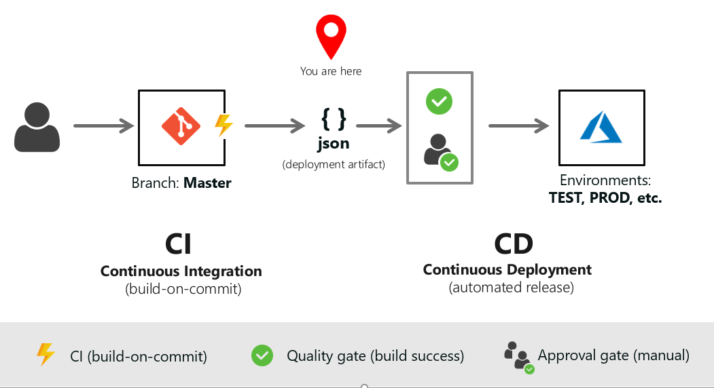
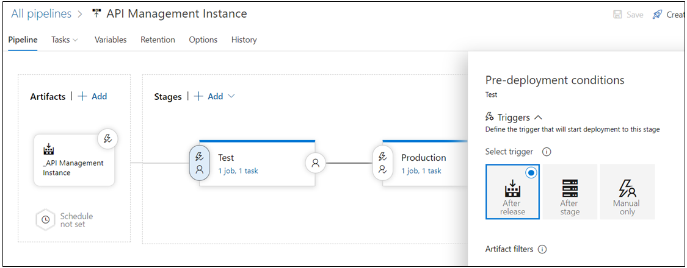
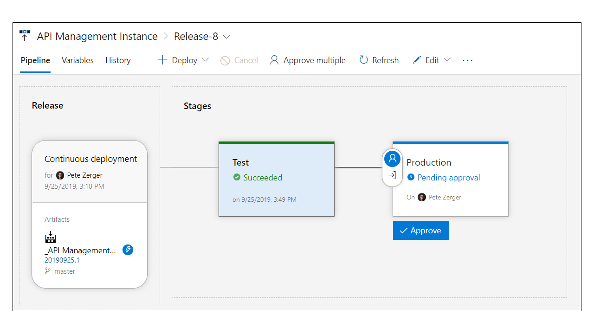

# Day 15: Connecting Integration and Continuous Deployment

In [Day 12](https://github.com/starkfell/100DaysOfIaC/blob/master/articles/day.12.contin.integration.md), we finished our CI pipeline with an artifact (an ARM template) ready to deploy.

You'll find the ARM template used in this installment [HERE](../resources/apim_instance/instance.json). Copy this into your own Git repo for hosting Infrastructure-as-Code related assets. 

> **NOTE:** In case you are wondering "how many Git repos will I have for IaC?", tune in for Day 16, when we will answer that question!

In this article:

[What are we deploying exactly?](#what-are-we-deploying-exactly)  
[The Release Pipeline](The-release-pipeline)  
[Phase 1: Deploy to TEST](#phase-1-deploy-to-test)  
[Phase 2: Deploy to PROD](#phase-2-deploy-to-prod)  
[Stage Configuration](#stage-configuration)  
[Deployment](#deployment)  
[Next Steps](#next-steps)  

## What are we deploying exactly?

Now, we are going to connect our CI to CD with a **release pipeline** in Azure DevOps (AZDO). We are intentionally working with one of the more complex services to fully integrate into CI/CD, Azure API Management, because it offers *many* opportunities to demonstrate advanced concepts!

> **NOTE:** Even if you don't use Azure API Management today, you owe it to yourself to follow this example for the IaC and DevOps learning opportunities it brings.

**Figure 1**. CICD Current State

## The Release Pipeline

This release pipeline is attached to the repository described in Day 12, which creates an ARM template to deploy an Azure API Management (APIM) instance. We're working off the **Master** code branch here. This assumes you have developed your template in a Develop code branch and deployed to a DEV instance before you promote your code to TEST, where proper testing will take place before deployment to PROD.

Remember, we are simply deploying the API Management instance (the infrastructure). There will be API instances, APIM policies, products, and groups defined and deployed on top of this as we progress!

Our release pipeline works in two stages (shown in Figure 3):

- Deploy to TEST
- Deploy to PROD

Let's break these down in more detail.

### Phase 1: Deploy to TEST

As you see in Figure 2, the stage in the release pipeline that deploys to TEST has a **quality gate**, which is successful build of our deployment artifact (ARM template). Your TEST APIM instance should be deployed to it's own resource group. This will be true for the TEST and PROD instances of just about anything you deploy to Azure, as these environments have different lifecycles and lifecycle management requirements.

**Figure 2**. Release Pipeline (concept)

And here is that release pipeline in Azure DevOps.

**Figure 3**. Release Pipeline for APIM Instance in Azure DevOps

The pre-deployment condition (quality gate) that triggers deployment to TEST is shown in Figure 4.

**Figure 4**. Trigger for deploy to TEST

### Phase 2: Deploy to PROD

The stage in the release pipeline that deploys to PROD has a **quality gate** (successful completion of previous stage) AND an **approval gate** (manual approval) prior to deployment. Only after a successful deployment to TEST and an approver clicking the **Approve** button (shown in Figure 5), does deployment to PROD proceed.

The bar for clicking approve should be validation in the TEST environment, whether manual or automatic. If you have APIs hosted in the instance, user acceptance testing (UAT) may be involved.

**Figure 5**. Approval Gate for PROD Release

### Stage Configuration

The configuration of each stage is very similar. Each consists of one task: **Azure resource group deployment**, as shown in Figure 6. Most of the configuration settings for each stage are pretty intuitive, but a couple of important items to note:

- Deployment mode should probably be set to **Incremental**, at least early in your IaC journey, also shown in Figure 6. This is more forgiving than the **Complete** option, which will remove any manual changes made outside the release pipeline.
  
- The values in **Agent job** should be left at their defaults, assuming you are using a Microsoft hosted build agent. The agent pool is **Hosted VS2017** by default, which provides the Windows-based build agent you need for ARM template deployment.

**Figure 6**. Deployment task in release stages

### Deployment

To deploy an API Management instance, you will simply perform a commit to your Git repo, and push the change. I keep a README file in the repo along with the JSON so I can make a simple change to the markdown document and perform a commit to trigger deployment. Note that an APIM instance will take more than 30 minutes to deploy to TEST, and another 30 for PROD! You will have time to get a coffee (or two) while you wait.

## Next Steps

This is far from the last layer of this ARM deployment scenario. In the next CI/CD related installment, we'll look at layering in some API Management configuration that requires delivery of an XML policy file, providing an opportunity to show effective use of Azure storage in an ARM deployment scenario.
