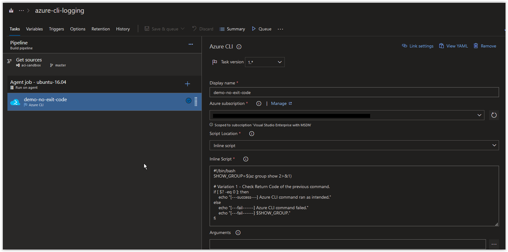
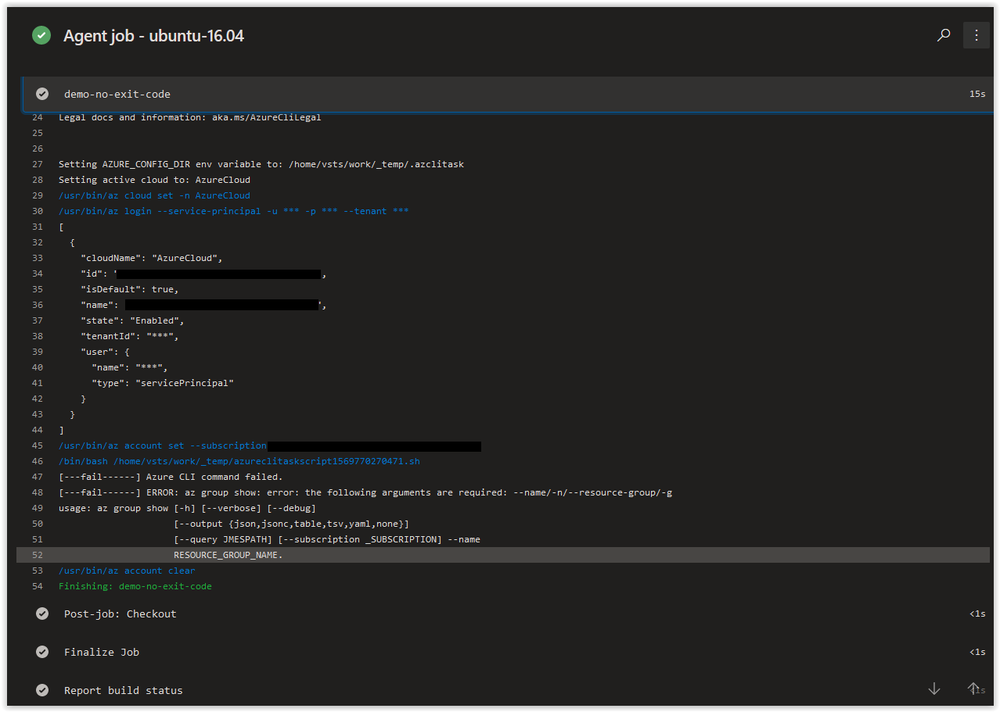
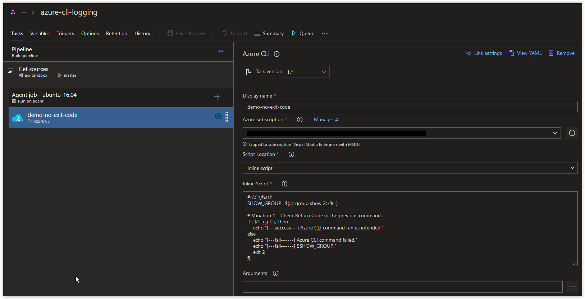
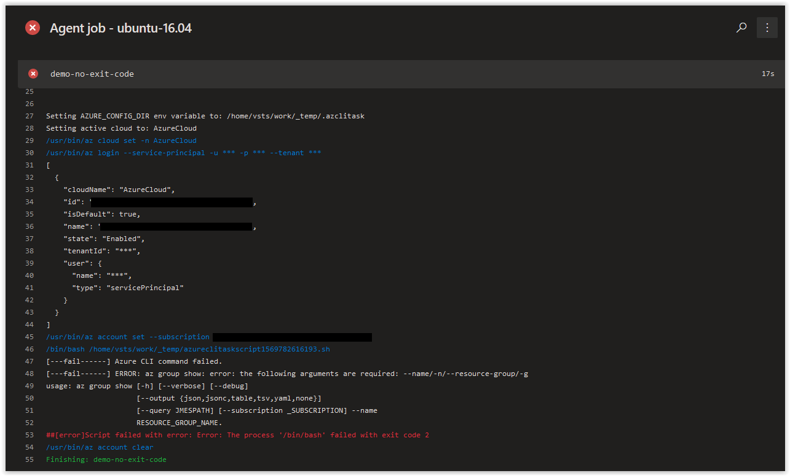

# Day 18 - Azure CLI Logging in Azure Build Pipelines, Redirections and Exit Codes (Linux Edition)

Today we are covering how redirecting STDERR to STDOUT and using exit codes can affect the behavior of your Azure Build Pipelines when using bash scripts in Azure CLI tasks.

The script below is going to be the focus of today's topic and is designed to fail on purpose.

```bash
#!/bin/bash
SHOW_GROUP=$(az group show 2>&1)

# Variation 1 - Check Exit Code of the previous command.
if [ $? -eq 0 ]; then
    echo "[---success---] Azure CLI command ran as intended."
else
    echo "[---fail------] Azure CLI command failed."
    echo "[---fail------] $SHOW_GROUP."
fi
```

<br />

When you add it as an inline script into a Build Pipeline in Azure DevOps, it should look similar to what is shown below.



This script is storing the results from the *az group show* command into a variable called **SHOW_GROUP**. This command is also redirecting all STDERR to STDOUT (that's the *2>&1* after the command) to ensure that we can verify the results of the command by looking at the contents of the **SHOW_GROUP** variable. Whether the command is successful or fails, we'll know because the results will be in the **SHOW_GROUP** variable.

After the command is executed, we are checking to see if the *SHOW_GROUP=$(az group show 2>&1)* returned either a **0** or something else. If anything else other than **0** is returned. The *else* section with the *Azure CLI command failed* will be echoed out along with the contents of the **SHOW_GROUP** variable which will contain the error message.

If you run this script above in an Azure Build Pipeline, you should get back the following result.



<br />

You'll notice that the Build Pipeline executed without any issues and didn't mention any failure. Since we redirected all STDERR to STDOUT in the command, the build Pipeline could not detect an actual error as everything pertaining to the command was encapsulated in the **SHOW_GROUP** variable.

This is something you need to be aware of when running any type of script in an Azure Build Pipeline. By redirecting STDERR to STDOUT and encapsulating all of your results from your commands into variables, you can completely control your error handling.

Now, if we want the same action to fail every time an actual error occurs in the script, but still maintain complete control of the results in the build, we need to use a return code and force the script to exit after parsing the results of the **SHOW_GROUP** variable.

The script below is identical to our previous script with one small change, there's an **exit 2** command in the last line of the *else* statement.

```bash
#!/bin/bash
SHOW_GROUP=$(az group show 2>&1)

# Variation 1 - Check Exit Code of the previous command.
if [ $? -eq 0 ]; then
    echo "[---success---] Azure CLI command ran as intended."
else
    echo "[---fail------] Azure CLI command failed."
    echo "[---fail------] $SHOW_GROUP."
    exit 2
fi
```

<br />

Below is the script inline, with the **exit 2** added.



<br />

If you run this script in the Azure Pipeline, you should get back the following results.



> **NOTE** If we were to change the *exit code* from **2** to **0**, the Build Pipeline Job would come back as successful.

<br />

## Conclusion

In today's article we covered how redirecting STDERR to STDOUT and using exit codes can affect the behavior of your Azure Build Pipelines when using bash scripts in the Azure CLI tasks.
