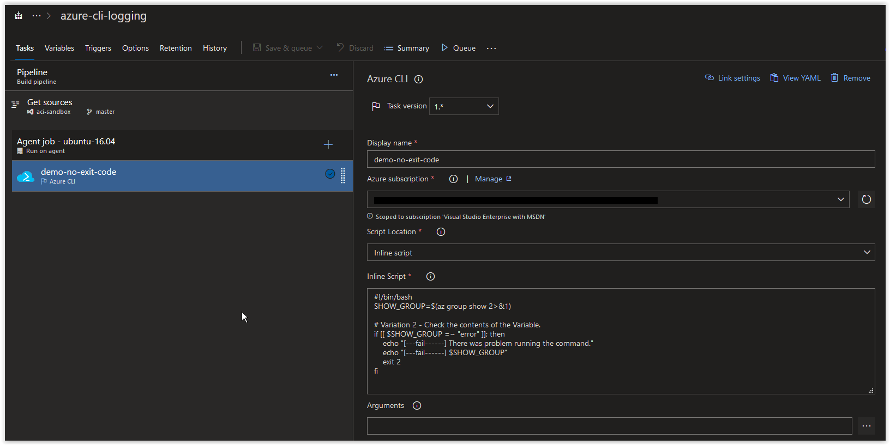
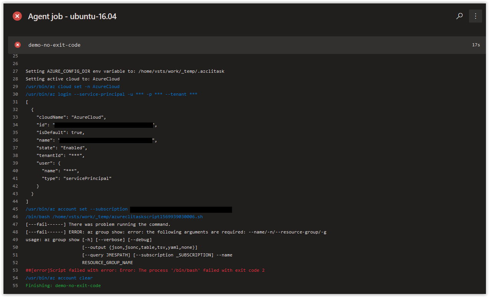
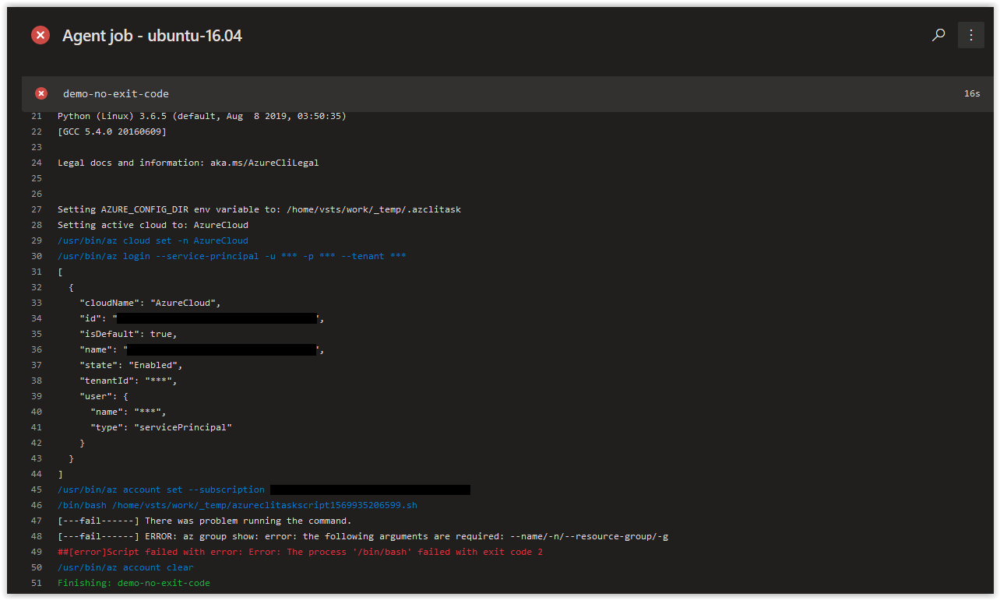

# Day 19 - Azure CLI Logging in Azure Build Pipelines, variable evaluation (Linux Edition)

In today's article we are going to go over how you can evaluate variables in bash script to manipulate the behavior of your Azure Build Pipelines in Azure CLI tasks.

We are going to be focusing on the same script that was used in [Day 18]() with some slight modifications.

```bash
#!/bin/bash
SHOW_GROUP=$(az group show 2>&1)

# Variation 2 - Check the contents of the Variable.
if [[ $SHOW_GROUP =~ "error" ]]; then
    echo "[---fail------] There was problem running the command."
    echo "[---fail------] echo $SHOW_GROUP"
    exit 2
fi
```

First off, if you run the command that is encapsulated in the **SHOW_GROUP** variable command from a bash prompt.

```bash
az group show 2>&1
```

You should back the following response.

```console
az group show: error: the following arguments are required: --name/-n/--resource-group/-g
usage: az group show [-h] [--verbose] [--debug]
                     [--output {json,jsonc,table,tsv,yaml,none}]
                     [--query JMESPATH] [--subscription _SUBSCRIPTION] --name
                     RESOURCE_GROUP_NAME
```

The reason we are getting an error is because we didn't provide the following arguments that are required by the **az group show** command.

```bash
--name
--resource-group
```

In the second part of the script, we are evaluating the contents of the **SHOW_GROUP** variable to see if the word **error** is found in it. 

```bash
if [[ $SHOW_GROUP =~ "error" ]]; then
    echo "[---fail------] There was problem running the command."
    echo "[---fail------] echo $SHOW_GROUP"
    exit 2
fi
```

If **error** is found, then the following error output is returned.

```console
[---fail------] echo ERROR: az group show: error: the following arguments are required: --name/-n/--resource-group/-g
usage: az group show [-h] [--verbose] [--debug]
                     [--output {json,jsonc,table,tsv,yaml,none}]
                     [--query JMESPATH] [--subscription _SUBSCRIPTION] --name
                     RESOURCE_GROUP_NAME
```

Let's add the script as an inline script into a Build Pipeline in Azure DevOps, it should look similar to what is shown below.



If you run this script above in an Azure Build Pipeline, you should get back the following result.



This works very well and returns everything back as intended. However, there are times where you may want to customize your output for errors so that they easier to read for troubleshooting purposes.

For instance, we could modify the script to only display the first line of the error message held in the **SHOW_GROUP** variable.

```bash
#!/bin/bash
SHOW_GROUP=$(az group show 2>&1)

# Variation 2 - Check the contents of the Variable.
if [[ $SHOW_GROUP =~ "error" ]]; then
    echo "[---fail------] There was problem running the command."
    echo "[---fail------] $SHOW_GROUP\n" | head -n 1
    exit 2
fi
```

If you modify the inline script in your Azure Build Pipeline to match the modified script above, you should get back the following result.



As you can see, the error message is very clear and much easier to read than the previious iteration.

This is something you can keep in mind when working with variable evaluation in your scripts in an Azure Build Pipeline, you have the ability to not only control how errors are processed, but you also have the ability to control how all output is displayed in Job Runs. This not allows you better readability, but allows you to quickly determine where the error occured and where you need to troubleshoot the issue, either in the task itself or something that may be missing or a syntax issue in your script.

## Conclusion

In today's article we covered how redirecting STDERR to STDOUT and using exit codes can affect the behavior of your Azure Build Pipelines when using bash scripts in the Azure CLI tasks.
