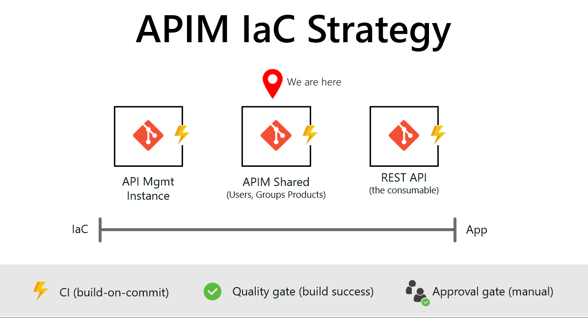
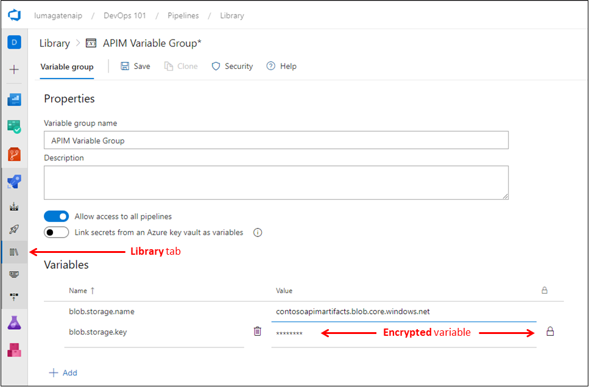
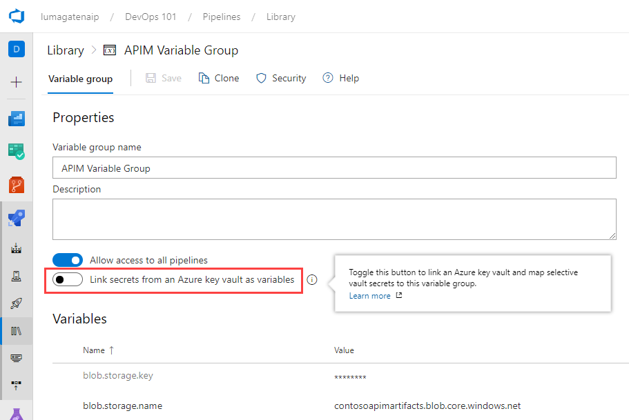

# Day 23 - Storage and Secrets in Infrastructure-as-Code (Part 2)

Variables give you a convenient way to get key bits of data into various parts of the pipeline. As the name suggests, the value of a variable may change from run to run or job to job of your pipeline. Almost any place where a pipeline requires a text string or a number, you can use a variable instead of hard coding a value.

In the case of our API Management (APIM) scenario we last discussed in [Day 22](https://github.com/starkfell/100DaysOfIaC/blob/master/articles/day.22.stage.in.storage.md), we have a couple of values that should not be hard-coded, like the SAS key and name for the blob storage we used to host a deployment artifact (the XML policy file of APIM, in this case).

**Figure 1**. API Management Scenario (from Day 22)

Let's get into some of the key capabilities of variables in Azure Pipelines.

## Pre-defined variables in Azure Pipelines

First, there are [several pre-defined system variables](https://docs.microsoft.com/en-us/azure/devops/pipelines/build/variables?view=azure-devops&tabs=yaml) that may come in handy. In particular, variables related to the build agent (a Windows VM in the case of an ARM template), like **Agent.WorkFolder**, **Agent.OSArchitecture**, and **Agent.OS** can be useful when you want to use a particular system utility. The **System.Debug** variable is helpful when you want to debug pipeline problems. You can read more about Azure Pipeline agents in ["Azure Pipeline agents"](https://docs.microsoft.com/en-us/azure/devops/pipelines/agents/agents?view=azure-devops).

There are pre-defined [release variables](https://docs.microsoft.com/en-us/azure/devops/pipelines/release/variables?view=azure-devops&tabs=batch) as well.

> **NOTE**: As in the programming world, these predefined variables are reserved names you should avoid using in naming your own build and release variables.

## Dynamic values as variables

If we have a value we may want to change at deploy time, I can store this value as a variable, and mark this variable as one that can be overridden at runtime. We do this by checking the *Settable at release time* checkbox, as shown in Figure 2.

**Figure 2**. Variable as *settable at release time*

This can come in handy for scenarios where we may want to deploy multiple instances from a pipeline. For example, if I created a release pipeline with an ARM template for a VM or VM scale set, I could store the Azure resource group name as a variable that I could set at deploy time to make this an easy tasks.

This can be equally useful with PaaS services, but in all cases, you'll want to be aware of any unique requirements in component or services names. Dynamic naming is a great topic for a future installment.

## Storing secrets

For secrets, like the SAS key, we should go a step further and encrypt that value if we are storing it as a variable. We do this by clicking the padlock, shown in Figure 3. If the padlock is locked, the variable with be encrypted and it's value masked with asterisks.

**Figure 3**. Storing SAS key in an encrypted variable

## Variable Groups

Variable groups are useful, in that we can store values that we want to make available across multiple pipelines. Variable groups are defined and managed in the **Library** page under Pipelines, as shown in Figure 4.

**Figure 4**. Variable groups in Azure Pipelines

In order to leverage a variable group in our pipeline, we need to link that variable group to our pipeline. We'll do this in the properties of our build or release pipeline, as shown in Figure 5.

**Figure 5**. Linking variable groups to a pipeline

We can go a step further with secure storage of secrets (SAS keys, passwords, certificates, etc.) by using Azure Key Vault (AKV), and then linking that AKV instance to our variables. We'll dig into AKV later this week.

**Figure 6**. Linking AKV to pipeline variables

## Next Steps

Variables and encrypted variables are a great way to make our build and release pipelines more dynamic and secure. Tomorrow, we will go a step further with our APIM blob storage scenario, and show how we can create a more dynamic and secure pipeline with some clever work directly in our ARM template. Later in the week, we will discuss storing secrets in Azure Key Vault.
