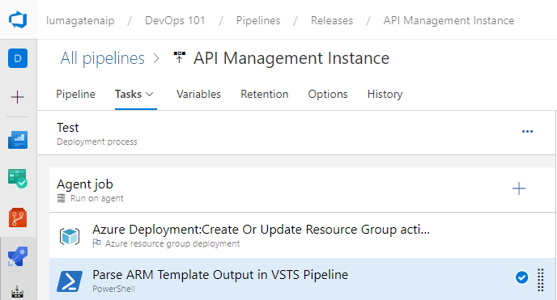

# Day 24 - Storage and Secrets in Infrastructure-as-Code (Part 3)

In Days 10, 12, and 15, we worked with the same ARM deployment scenario, focused on Azure API Management, as an example of a more complex Infrastructure-as-Code Scenario. In Days 22 and 23, we explored using blob storage to host deployment artifacts that could not be easily encapsulated in our ARM template. In this installment, we are going to look at provisioning that blob storage and enabling access, all within an ARM template.

Our ARM template 1) Creates blob storage 2) A SAS key with the access we define and 3) Outputs container and SAS key details we can use later in the pipeline. For readability, I am not going to embed the entire ARM template in the article, but give you a link to the full template in the repo [HERE](https://github.com/starkfell/100DaysOfIaC/blob/master/resources/storage_sas_out.json). Just open it on your second screen so you can reference as you follow along.

**In this article:**

[Setting Permissions](#setting-permissions) </br>
[Generate Connection String with SAS token](#generate-connection-string-with-sas-token) </br>
[ARM Outputs](#arm-outputs) </br>
[Deployment Outputs](#deployment-outputs) </br>
[Next Steps](#next-steps) </br>

## Setting Permissions

If you look at the **"accountSasProperties"** section of the template in Figure 1, we are describing the SAS key we will create dynamically to access this which are explained immediately below the figure.

``` JSON
        "accountSasProperties": {  
            "type": "object",  
            "defaultValue": {  
                "signedServices": "b",  
                "signedPermission": "rw",  
                "signedResourceTypes": "sco",  
                "keyToSign": "key2",  
                "signedExpiry": "[parameters('sasTokenExpiry')]"  
            }  
```
**Figure 1**.  section of the Storage ARM Template

There are several *required* values, described here:

- **signedService** - This indicates which storage service type the token can access. The accepted values are b (blob), f (file), q (queue), and t (table). You can specify multiple values by simply providing multiple letters (like bfqt).
- **signedPermission** - This conveys the permissions granted by the token. Accepted values are - r (read), w (write), d (delete), l (list), a (add), c (create), u (update), p (process). Again you can specify multiples
- **signedExpiry** - The date and time the token expires, allowing us to expire the key shortly after our deployment.
- **signedResourceTypes** - This specifies the scope of APIs accessible with the token. Accepted values are s (service), c (container), o (object). To read into these further, visit MS Docs [HERE](https://docs.microsoft.com/en-us/rest/api/storageservices/create-account-sas)

There are several *optional* values we can provide as well:

- **keyToSign** - The key to use for signing the account SAS token.
- **signedIP** - The IP address or IP range that can use token.
- **signedProtocol** - Whether it supports HTTPS and/or HTTP.
- **signedStart** - The token start date and time.

## Generate connection string with SAS token

As per the above full ARM Template, we can see the connection string is generated with full access and another is generated with SAS token. In order to generate a connection string with SAS token, I have used the **listAccountSas** ARM function.
 
Find more details about this function [HERE](https://docs.microsoft.com/en-us/rest/api/storagerp/storageaccounts/listaccountsas).


## ARM Outputs

Using the Outputs feature in ARM, I am outputting four values to show how all of them are constructed, shown in Figure 2.

- **BlobEndpoint**. This is the blob endpoint URL (https://storageAccountName.blob.core.windows.net)
- **SASKey**. This is the key generated by the logic in our the ARM template.
- **storageAccountConnectionString**. The connection string with full access.
- **storageAccountConnectionStringWithSAS**. Connection string + SAS token, limiting access.

``` JSON
    "outputs": {  
        "blobEndPoint": {
        "type": "string",  
        "value": "[concat('https://',variables('storageAcctShortName'),'.blob.core.windows.net/')]"
        },
        "SASKey": {
        "type": "string",  
        "value": "[listAccountSas(parameters('StorageAccountName'), '2018-07-01', parameters('accountSasProperties')).accountSasToken]"
        },
        "storageAccountConnectionString": {  
            "type": "string",  
            "value": "[concat('DefaultEndpointsProtocol=https;AccountName=', variables('storageAcctShortName'), ';AccountKey=', listKeys(resourceId('Microsoft.Storage/storageAccounts', variables('storageAcctShortName')), variables('storageAccountApiVersion')).keys[0].value)]"  
        },  
        "storageAccountConnectionStringWithSAS": {  
            "type": "string",  
            "value": "[concat('BlobEndpoint=',variables('blobEndPoint'),';SharedAccessSignature=', listAccountSas(variables('storageAcctShortName'), variables('storageAccountApiVersion'), parameters('accountSasProperties')).accountSasToken)]"  
        } 
```
**Figure 2**. Outputs of Storage Deployment via ARM Template

If we look at these outputs in the Azure portal, they appear as shown in Figure 3.


**Figure 3**. ARM Template Outputs in the Azure Portal

## Deployment Outputs

You can store the output values from your ARM template in the **Azure Resource Manager Deployment** task in the **Deployments Output** section, as shown in Figure 4. Outputs created by Azure Resource Manager template deployment. It can be used in the subsequent tasks (like PowerShell and Azure CLI) for further processing. You can parse the deployment output using the `ConvertFrom-Json` PowerShell cmdlet in PowerShell or Azure PowerShell task and then that object can be used in same task or subsequent tasks.



**Figure 4**. Parse ARM Outputs with PowerShell

This is a pretty cool feature, and is already really well documented in ["Parsing your ARM Template Output in VSTS Pipelines"](https://blogs.technet.microsoft.com/stefan_stranger/2018/05/10/parsing-your-arm-template-output-in-vsts-pipelines/) on TechNet Community, so I am not going to rehash it here. More importantly, we're going to climb to the top of the mountain in the next couple of days, digging into **Azure Key Vault** integration in release pipelines. So in the end, you may well consider skipping this entirely.

## Next Steps

Over the rest of this week, we're going to dig into what are perhaps the most compelling options for secure handling of secrets in IaC, leveraging Azure Key Vault! 