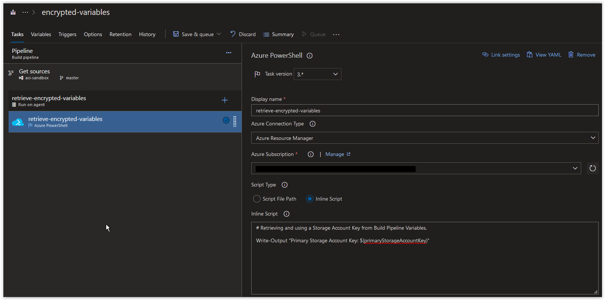
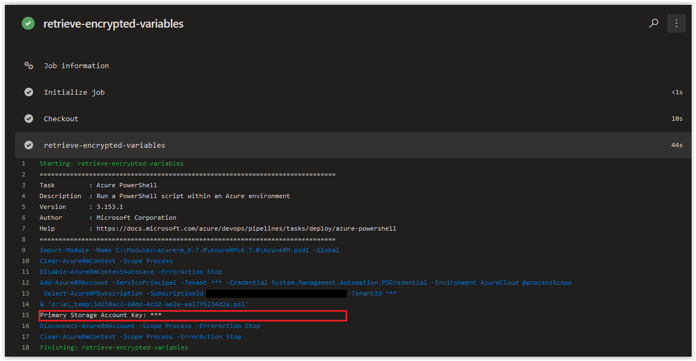

# Day 29 - Build Pipelines, using Variables (Windows Edition)

In today's article we are going to cover how to use a Storage Account Key in an Azure PowerShell Task in a Build Pipeline. The methods demonstrated in this article can also be used for several other IaaS and PaaS Offerings available in Azure.

> **NOTE:** This article was tested and written for an Azure Build Pipeline using a Microsoft-hosted Agent running vs2017-win2016 and a separate Windows Host running Windows 10 with Azure CLI installed.

## Create a Resource Group and Storage Account

<br />

On your Windows Host (with Azure CLI installed), open up a PowerShell prompt and run the following command to create a new Resource Group.

```powershell
az group create `
--name encrypted-variables `
--location westeurope
```

You should get back the following output:

```console
{
  "id": "/subscriptions/00000000-0000-0000-0000-000000000000/resourceGroups/encrypted-variables",
  "location": "westeurope",
  "managedBy": null,
  "name": "encrypted-variables",
  "properties": {
    "provisioningState": "Succeeded"
  },
  "tags": null,
  "type": "Microsoft.Resources/resourceGroups"
}
```

<br />

Next, run the following command randomly generate 4 alphanumeric characters.

```powershell
$RandomAlpha = (New-Guid).ToString().Substring("0","4")
```

> **NOTE:** We are appending this to the name of our Storage Account to ensure we create a unique Storage Account name.

<br />

Run the following command to create a new Storage Account.

```powershell
$NewStorageAccount = az storage account create `
--name "encryptvardemo$RandomAlpha" `
--resource-group encrypted-variables
```

You should get back the following output:

```console
The default kind for created storage account will change to 'StorageV2' from 'Storage' in future
 - Running ..
```

<br />

You can run the following command to verify that the Storage Account was provisioned successfully.

```powershell
($NewStorageAccount | ConvertFrom-Json).provisioningState
```

You should get back the following output:

```console
"Succeeded"
```

<br />

Next, run the following command to retrieve the Primary Key for your new Storage Account.

```powershell
az storage account keys list `
--account-name "encryptvardemo$RandomAlpha" `
--query [0].value `
--output tsv
```

You should get back the Primary Key of your new Storage Account which should look similar to the one below:

```console
lB7TsIMia9dCqFBI1ICC0u5JHQeZO87fBpy5adfy9x/kb80k9vJ0wSObbGLfxBXnVpmJZDZ3T8S62o7y5gualA==
```

<br />

## Using the Storage Account Key in a Build Pipeline Variable

Next, in an Azure DevOps Pipeline, copy the Storage Account Key into a a new variable called **primaryStorageAccountKey** in a Build Pipeline.


<br />

Next, change the Storage Account Key value by pressing the **Lock Icon** on the far right side of the **primaryStorageAccountKey** variable.


<br />

The Storage Account Key should now be secured and displayed only as a set of asterisks.

<br />

Next, in the Tasks section of the Pipeline, create an Azure PowerShell Task called **retrieve-encrypted-variables** in the Build Pipeline called and paste in the following code below as an Inline script. After your task looks like what is shown below, click on **Save & queue** to run the Build.

```powershell
# Retrieving and using a Storage Account Key from Build Pipeline Variables.

Write-Output "Primary Storage Account Key: $(primaryStorageAccountKey)"
```

> NOTE: If the Azure PowerShell Task is asking you for an *Azure PowerShell Version* to use, just choose the **Latest installed version** option.



<br />

When the Build finishes, you should see the Storage Account Key displayed in all asterisks.



Although the job displays the Storage Account Key in asterisks, the value can still be used in your script where required.

<br />

## Conclusion

In today's article we covered how to use and store a Storage Account Key as a variable in an Azure PowerShell Task in a Build Pipeline. If there's a specific scenario that you wish to be covered in future articles, please create a **[New Issue](https://github.com/starkfell/100DaysOfIaC/issues)** in the [starkfell/100DaysOfIaC](https://github.com/starkfell/100DaysOfIaC/) GitHub repository.
