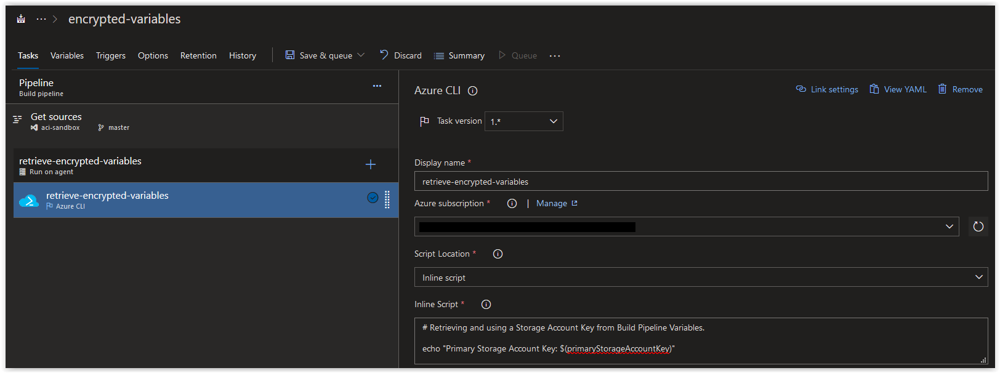
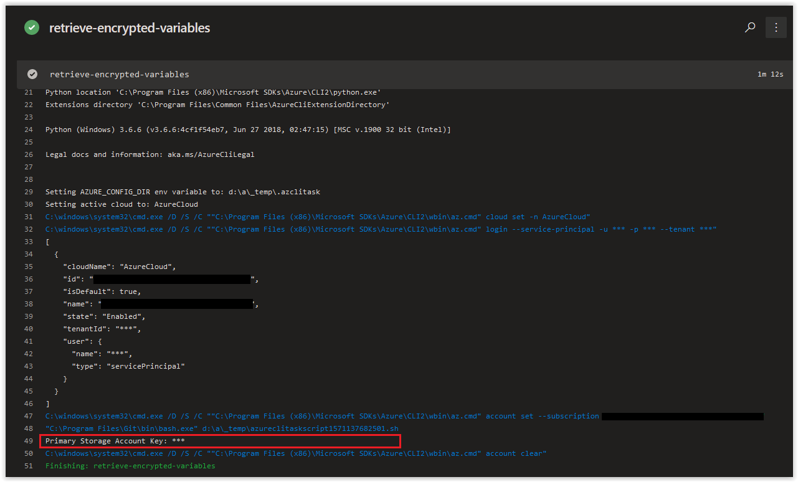
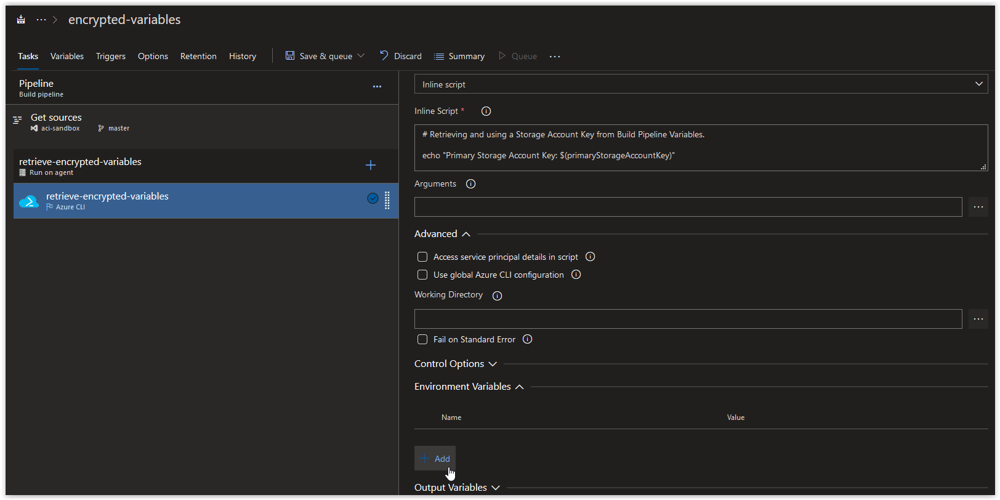
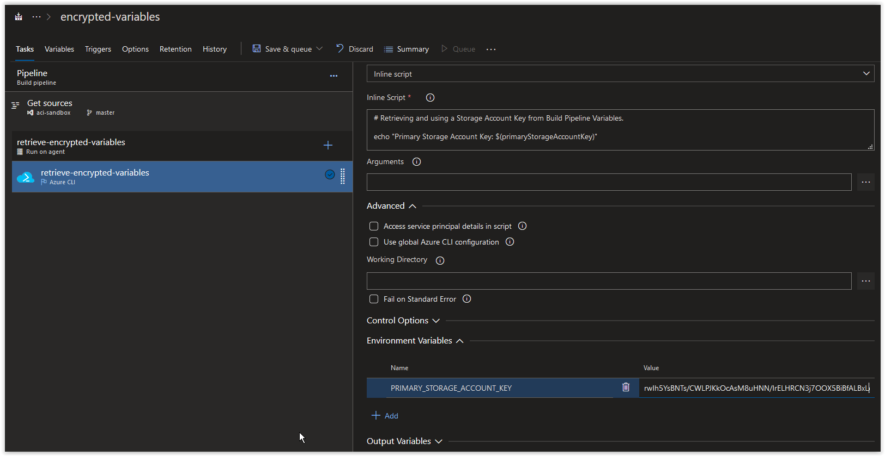
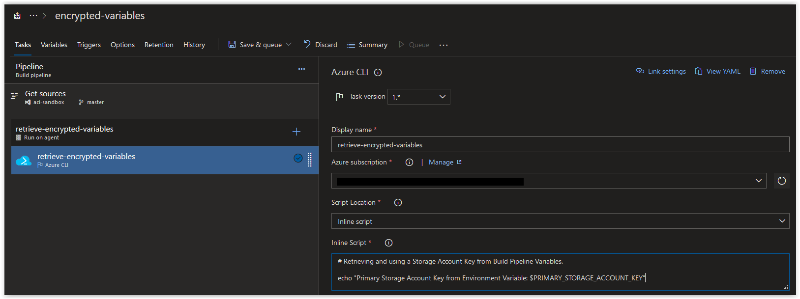
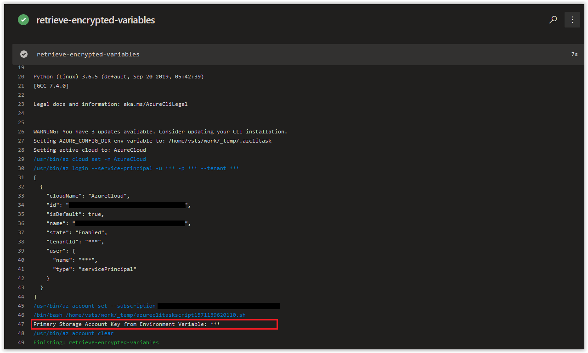

# Day 30 - Build Pipelines, using Variables (Linux Edition)

In today's article we are going to cover how to use a Storage Account Key in an Azure CLI Task in a Build Pipeline. The methods demonstrated in this article can also be used for several other IaaS and PaaS Offerings available in Azure.

> **NOTE:** This article was tested and written for an Azure Build Pipeline using a Microsoft-hosted Agent running Ubuntu 18.04 and a separate Linux Host running Ubuntu 18.04 with Azure CLI installed.

**In this article:**

[Create a new Resource Group and Storage Account](#create-a-resource-group-and-storage-account)<br />
[Using the Storage Account Key in a Build Pipeline Variable](#using-the-storage-account-key-in-a-build-pipeline-variable)<br />
[Using the Storage Account Key as an Environment Variable](#using-the-storage-account-key-as-an-environment-variable)<br />
[Conclusion](#conclusion)

<br />

## Create a Resource Group and Storage Account

<br />

On your Linux Host (with Azure CLI installed), open up a bash prompt and run the following command to create a new Resource Group.

```bash
az group create \
--name encrypted-variables \
--location westeurope
```

You should get back the following output:

```console
{
  "id": "/subscriptions/00000000-0000-0000-0000-000000000000/resourceGroups/encrypted-variables",
  "location": "westeurope",
  "managedBy": null,
  "name": "encrypted-variables",
  "properties": {
    "provisioningState": "Succeeded"
  },
  "tags": null,
  "type": "Microsoft.Resources/resourceGroups"
}
```

<br />

Next, run the following command randomly generate 4 alphanumeric characters.

```bash
RANDOM_ALPHA=$(cat /dev/urandom | tr -dc 'a-z0-9' | fold -w 4 | head -n 1)
```

> **NOTE:** We are appending this to the name of our Storage Account to ensure we create a unique Storage Account name.

<br />

Run the following command to create a new Storage Account.

```bash
NEW_STORAGE_ACCOUNT=$(az storage account create \
--name "encryptvardemo${RANDOM_ALPHA}" \
--resource-group encrypted-variables)
```

You should get back the following output:

```console
The default kind for created storage account will change to 'StorageV2' from 'Storage' in future
 - Running ..
```

<br />

Run the following command to verify that the Storage Account was provisioned successfully.

```bash
echo $NEW_STORAGE_ACCOUNT | jq .provisioningState
```

You should get back the following output:

```console
"Succeeded"
```

<br />

Next, run the following command to retrieve the Primary Key for your new Storage Account.

```bash
az storage account keys list \
--account-name "encryptvardemo${RANDOM_ALPHA}" \
--query [0].value \
--output tsv
```

You should get back the Primary Key of your new Storage Account which should look similar to the one below:

```console
rwIh5YsBNTs/CWLPJKkOcAsM8uHNN/IrELHRCN3j7OOX5BiBfALBxLgw8pame0hDCW+m6ehv169iOetD+E6ZpQ==
```

<br />

## Using the Storage Account Key in a Build Pipeline Variable

Next, in an Azure DevOps Pipeline, click on the Variables tab and copy the Storage Account Key into a a new variable called **primaryStorageAccountKey**.


<br />

Next, change the Storage Account Key value by pressing the Lock Icon on the far right side of the **primaryStorageAccountKey** variable.


<br />

The Storage Account Key should now be secured and displayed only as a set of asterisks.

<br />

Next, on the Tasks tab in the Build Pipeline, create an Azure CLI Task called **retrieve-encrypted-variables** and paste in the following code below as an Inline script. After your task looks like what is shown below, click on **Save & queue** to run the Build.

```bash
# Retrieving and using a Storage Account Key from Build Pipeline Variables.

echo "Primary Storage Account Key: $(primaryStorageAccountKey)"
```

<br />



<br />

When the Build finishes, you should see the Storage Account Key displayed in all asterisks.



Although the job displays the Storage Account Key in asterisks, the value can still be used in your script where required.

<br />

## Using the Storage Account Key as an Environment Variable

Next, go back to your Azure CLI Task from earlier, scroll down and expand the **Environment Variables** section and click the **Add** button.



<br />

Create a new Environment Variable called **PRIMARY_STORAGE_ACCOUNT_KEY** and copy the Storage Account Key into it.



> **NOTE:** You'll notice that the Storage Account Key will be shown in clear text when stored as an Environment Variable; however, when the job runs, it'll appear in all asterisks.

<br />

Next, paste in the following script into the Inline script section of the task and then click on on **Save & queue** to run the Build.

```bash
# Retrieving and using a Storage Account Key from Build Pipeline Variables.

echo "Primary Storage Account Key from Environment Variable: $PRIMARY_STORAGE_ACCOUNT_KEY"
```



<br />

When the Build finishes, you should see the Storage Account Key displayed in all asterisks.



<br />

## Conclusion

In today's article we covered how to use and store a Storage Account Key as a variable in an Azure CLI Task in a Build Pipeline. If there's a specific scenario that you wish to be covered in future articles, please create a **[New Issue](https://github.com/starkfell/100DaysOfIaC/issues)** in the [starkfell/100DaysOfIaC](https://github.com/starkfell/100DaysOfIaC/) GitHub repository.
