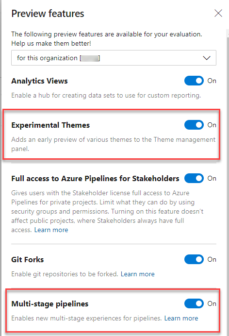
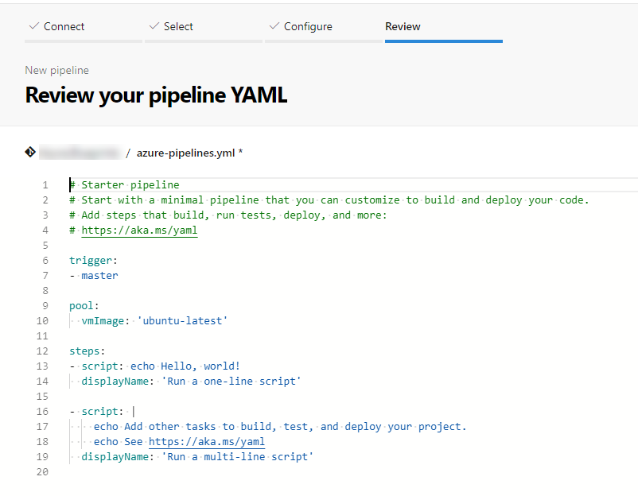
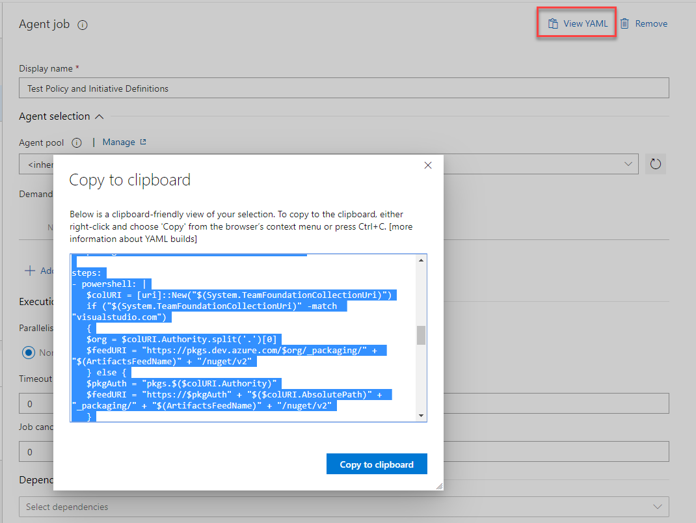
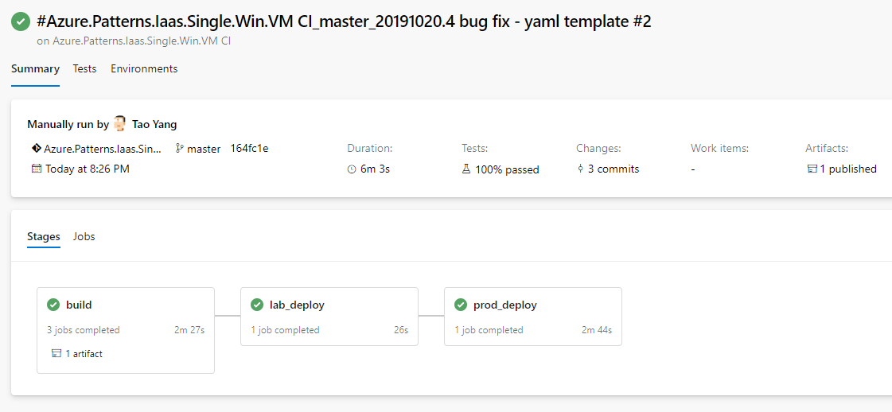
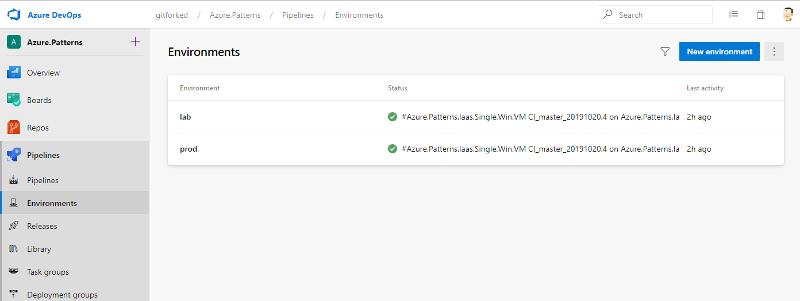

# Day 34 - YAML Pipelines in Azure DevOps: How

*Today's post comes from guest contributor Tao Yang [@MrTaoYang](https://twitter.com/mrtaoyang). Tao is a Microsoft MVP who from 9-to-5 focuses on DevOps and governance in Azure for enterprise customers. You can find Tao blogging at [Managing Cloud and Datacenter by Tao Yang](https://blog.tyang.org/).*

Today, we are continuing our discussion on [Azure DevOps YAML pipelines](https://docs.microsoft.com/en-us/azure/devops/pipelines/yaml-schema?view=azure-devops&tabs=schema&WT.mc_id=DOP-MVP-5000997). After we have discussed why and when to use YAML pipelines in Azure DevOps, we are going to get started with creating YAML pipelines.

You will also find a sample multi-stage YAML pipeline in appendix. this pipeline deploys an ARM template (that contains a single VM) to two Azure subscriptions after the build / test stage.

**In this article:**

[Getting Started with YAML Pipelines](#getting-started-with-yaml-pipelines)  
[Create Your First YAML Pipeline](#create-your-first-yaml-pipeline)  
[Conclusion](#conclusion)  
[Appendix - Multi-stage YAML Pipeline Example](#appendix---multi-stage-yaml-pipeline-example)  

## Getting Started with YAML Pipelines
At the time of writing, Multi-stage YAML piplines is still in preview. Although you can still create YAML pipelines without enabling this preview, but you will most definitely utilize it. You may enable it for either your account, or for the entire organization in the Azure DevOps portal.

I have also enabled the Experimental Themes preview. If the screenshots in this article differs from what you see in Azure DevOps portal, this is probably the reason. I encourage you to enable this preview too. I did find it has made the portal easier to navigate.

To enable preview features, click on your profile avatar on the top right of the portal, and select ***Preview features***. Then select the scope from the drop-down list (either for yourself or for the entire organisation), and enable the preview features (as shown below).

To create a blank pipeline, upi can either use the GUI interface via the portal (as shown below), or use AzureCLI.

Microsoft provides several quick start guides on creating your first YAML pipeline:
 
* [Create your first pipeline](https://docs.microsoft.com/en-us/azure/devops/pipelines/create-first-pipeline?view=azure-devops&WT.mc_id=DOP-MVP-5000997)
* [Create your first pipline from CLI](https://docs.microsoft.com/en-us/azure/devops/pipelines/create-first-pipeline-cli?view=azure-devops&WT.mc_id=DOP-MVP-5000997)
* [Customize your pipeline](https://docs.microsoft.com/en-us/azure/devops/pipelines/customize-pipeline?view=azure-devops&WT.mc_id=DOP-MVP-5000997)

Alternatively, when you are developing your IaC solution, you can simply create an "***azure-pipelines.yml***" file on the root folder of your git repository, and when you are ready, push it to the remote repo that your Azure DevOps is connecting to (i.e. GitHub or Azure DevOps).

## Create Your First YAML pipeline
In classic pipelines, you can export YAML code for each agent job by clicking the ***View YAML*** link for each job (as shown below). When you are already comfortable creating classic CI/CD pipelines, the best way to start building your first YAML pipeline is probably by copy and paste the YAML export from a similar classic pipeline to the YAML pipeline.

> **NOTE:** Based on my experience, the syntax of the YAML export from the classic pipeline may not always be correct. If you get errors when running the pipeline, make sure you always check the syntax against the Microsoft documentation. You can find the YAML definition for each task at Microsoft's documentation site: [Build and release tasks](https://docs.microsoft.com/en-us/azure/devops/pipelines/tasks/?view=azure-devops&WT.mc_id=DOP-MVP-5000997)

Unlike classic pipelines, YAML pipelines do not differenciate build (CI) and release (CD) pipelines. If you are using Multi-stage YAML pipeline, you are able to combine your build and all release stages into one single pipeline.

When using Multi-stage YAML pipelines, You would define a stage for build, and a stage for each of the release stages (i.e. your dev, test and production environments) (as shown below):

If any of the stages requires approval (for example, when a release manager must approve the release to production environment), you will need to create different environments within the Azure DevOps project (as shown below), assign approvers to the environments, then associate the stage in the environment within your YAML pipeline. You can find more information on approvals at Microsoft's documentation site: [Approvals and other checks](https://docs.microsoft.com/en-us/azure/devops/pipelines/process/approvals?view=azure-devops&WT.mc_id=DOP-MVP-5000997). The sample pipeline in the Appedix has adopted this feature for your reference.

Once you have committed your code into the Git repo, you will find the pipeline is automatically created (as shown below):

## Conclusion
In today's article, we have briefly explained how to get started with YAML pipelines. Make sure to check out the sample multi-stage YAML pipeline in the appendix below.

## Appendix - Multi-stage YAML Pipeline Example

~~~ yaml
name: $(BuildDefinitionName)_$(SourceBranchName)_$(Date:yyyyMMdd)$(Rev:.r)
trigger:
  branches:
    include:
    - master
  paths:
    exclude:
    - README.md
  
stages:
- stage: build
  jobs:
  - job: Pester_Tests
    variables:
      - group: Tests - Single-Win-VM-On.VMExtensions
    displayName: Pester Tests
    pool:
      name: Hosted Windows 2019 with VS2019
      demands: azureps
    steps:
    - powershell: |
        $FeedName = 'PSGallery'
        Install-PackageProvider Nuget -Scope CurrentUser -Force
        Install-module PSScriptAnalyzer -force -Scope CurrentUser -Repository $FeedName
        Install-module PSPesterTest -force -Scope CurrentUser -Repository $FeedName
      displayName: 'Install required PowerShell modules'

    - task: richardfennellBM.BM-VSTS-PesterRunner-Task.Pester-Task.Pester@8
      displayName: 'Pester Test Runner - Mgmt Network Template'
      inputs:
        scriptFolder: '@{Path=''$(System.DefaultWorkingDirectory)\tests\ARMTemplate\Test.ARMTemplate.ps1''; Parameters=@{TemplatePath =''$(System.DefaultWorkingDirectory)\templates\Win.Server.No.VMExtensions\azuredeploy.json''; parameters =$(parameters); variables = $(variables); resources = $(resources)}}'
        resultsFile: '$(System.DefaultWorkingDirectory)\TEST-SingleWinServerNoExtension.xml'

    - task: PublishTestResults@2
      displayName: 'Publish Test Results **/TEST-*.xml'
      inputs:
        testResultsFormat: NUnit

  - job: ARM_Deployment_Validation
    variables:
    - group: Variables - Single-Win-VM (lab)
    displayName: ARM Deployment Validation
    dependsOn: Pester_Tests
    steps:
    - task: AzureResourceGroupDeployment@2
      displayName: 'Template Validation - Win Server No VM Extensions'
      inputs:
        azureSubscription: 'sub-lab'
        resourceGroupName: '$(resourceGroup)'
        location: '$(location)'
        csmFile: templates/Win.Server.No.VMExtensions/azuredeploy.json
        csmParametersFile: templates/Win.Server.No.VMExtensions/parameters/lab.azuredeploy.parameters.json
        overrideParameters: '-adminUsername $(adminUsername) -adminPassword $(adminPassword)'
        deploymentMode: Validation

  - job: Publish_Pattern
    displayName: Publish Pattern
    dependsOn: 
    - Pester_Tests
    - ARM_Deployment_Validation
    steps:
    - task: CopyFiles@2
      displayName: 'Copy Files to: $(Build.ArtifactStagingDirectory)'
      inputs:
        SourceFolder: '$(Build.SourcesDirectory)'
        TargetFolder: '$(Build.ArtifactStagingDirectory)'
        CleanTargetFolder: true
        OverWrite: true

    - task: PublishBuildArtifacts@1
      displayName: 'Publish Artifact: drop'

- stage: lab_deploy
  jobs:
    - deployment: lab_deploy
      variables:
      - group: Variables - Single-Win-VM (lab)
      displayName: 'Deploy to Lab environment'
      pool:
        name: Hosted Windows 2019 with VS2019
        demands: azureps
      environment: 'lab'
      strategy:
        runOnce:
          deploy:
            steps:
            - task: AzureResourceGroupDeployment@2
              displayName: 'Deploy Update Schedules ARM Template'
              inputs:
                azureSubscription: 'sub-lab'
                resourceGroupName: '$(resourceGroup)'
                location: '$(location)'
                csmFile: '$(Agent.BuildDirectory)/drop/templates/Win.Server.No.VMExtensions/azuredeploy.json'
                csmParametersFile: '$(Agent.BuildDirectory)/drop/templates/Win.Server.No.VMExtensions/parameters/lab.azuredeploy.parameters.json'
                overrideParameters: '-adminUsername $(adminUser) -adminPassword $(adminPassword)'
- stage: prod_deploy
  jobs:
    - deployment: prod_deploy
      variables:
      - group: Variables - Single-Win-VM (prod)
      displayName: 'Deploy to Production environment'
      pool:
        name: Hosted Windows 2019 with VS2019
        demands: azureps
      environment: 'prod'
      strategy:
        runOnce:
          deploy:
            steps:
            - task: AzureResourceGroupDeployment@2
              displayName: 'Deploy Update Schedules ARM Template'
              inputs:
                azureSubscription: 'sub-prod'
                resourceGroupName: '$(resourceGroup)'
                location: '$(location)'
                csmFile: '$(Agent.BuildDirectory)/drop/templates/Win.Server.No.VMExtensions/azuredeploy.json'
                csmParametersFile: '$(Agent.BuildDirectory)/drop/templates/Win.Server.No.VMExtensions/parameters/prd.azuredeploy.parameters.json'
                overrideParameters: '-adminUsername $(adminUser) -adminPassword $(adminPassword)'
~~~