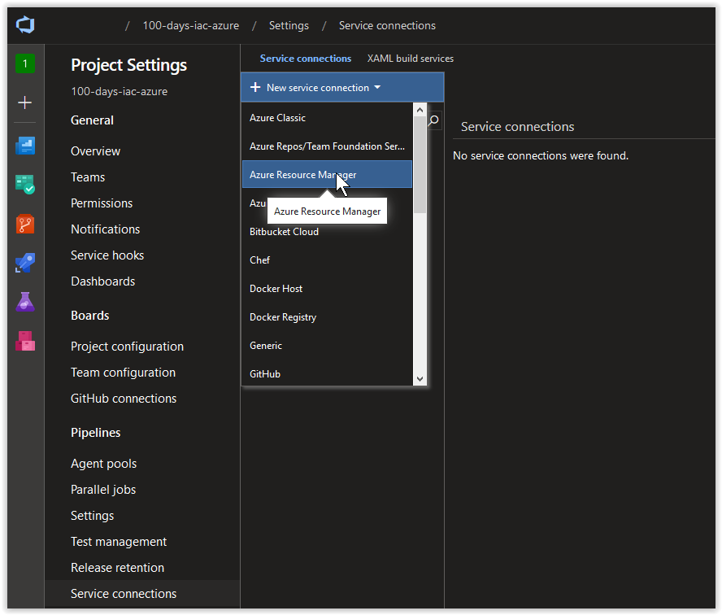
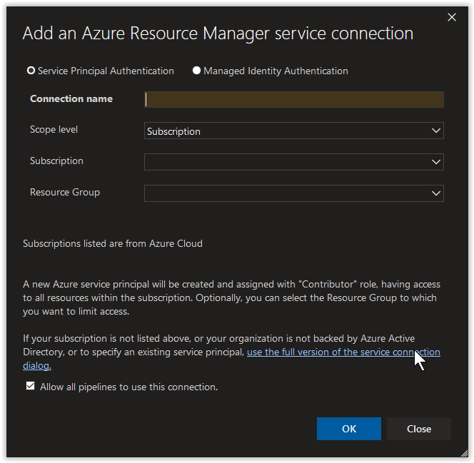
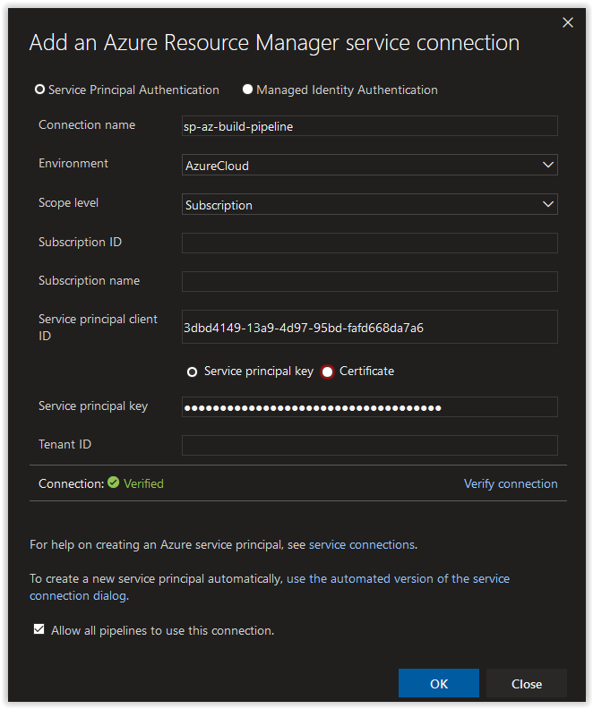
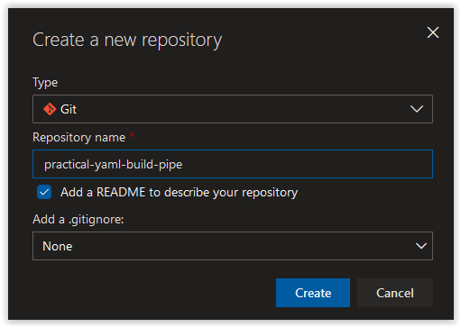
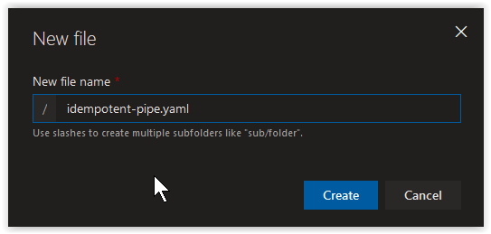
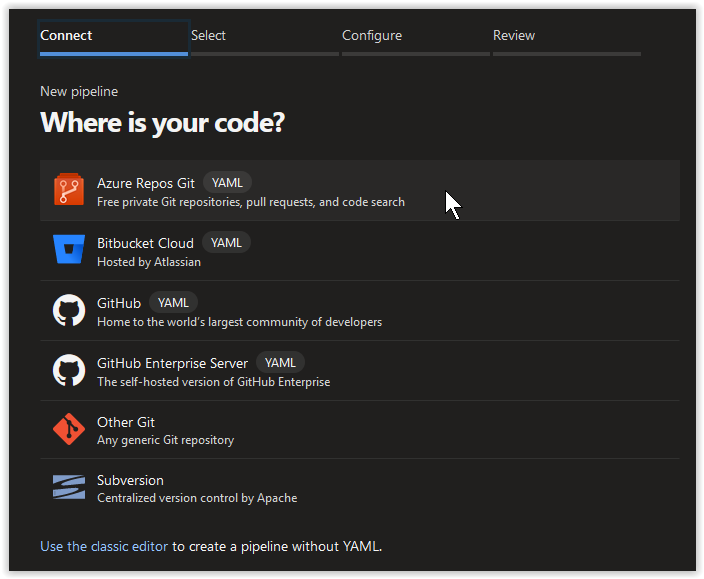
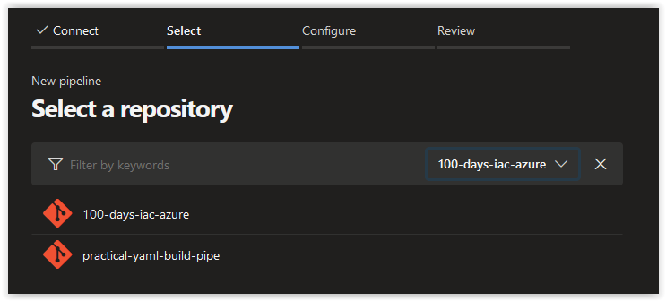
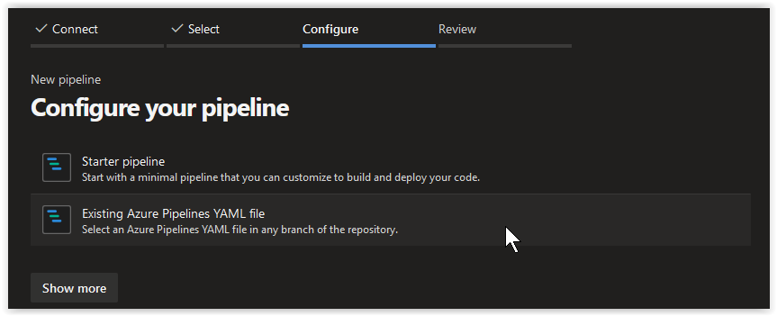
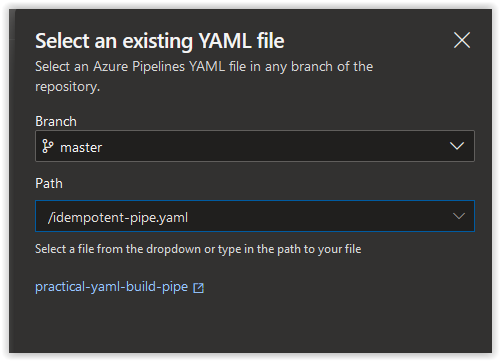
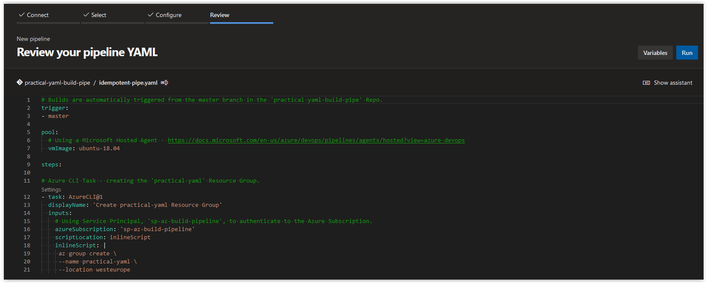

# Day 35 - Practical Guide for YAML Build Pipelines in Azure DevOps - Part 1

*This is the first in a series of posts about how to build your Azure DevOps Pipeline using YAML. **Part 2** of this series can be found **[here](./day.38.building.a.practical.yaml.pipeline.part.2.md)**.*

</br>

Today, we are going to take you through the process of setting up a Build Pipeline as Code using YAML in Azure DevOps. In future installments, we will continue to build on the content used in this article.

**In this article:**

[Creating a Service Principal for the Build Pipeline](#create-a-service-principal-for-the-build-pipeline)</br>
[Create a new Service Connection for the Service Principal](#create-a-new-service-connection-for-the-service-principal)</br>
[Create a Repo in Azure DevOps for the Build Pipeline](#create-a-repo-in-azure-devops-for-the-build-pipeline)</br>
[Create a YAML File for the Build Pipeline](#create-a-yaml-file-for-the-build-pipeline)</br>
[Explanation of the Build Pipeline YAML File](#explanation-of-the-build-pipeline-yaml-file)</br>
[Create a new Build Pipeline](#create-a-new-build-pipeline)</br>
[Conclusion](#conclusion)</br>

## Create a Service Principal for the Build Pipeline

On your Linux Host (with Azure CLI installed), open up a bash prompt and run the following command to retrieve your Azure Subscription ID.

```bash
AZURE_SUB_ID=$(az account show --query id --output tsv)
```

If the above command doesn't work, manually add your Azure Subscription ID to the variable.

```powershell
AZURE_SUB_ID=("00000000-0000-0000-0000-000000000000")
```

On your Linux Host (with Azure CLI installed), open up a bash prompt and run the following command to create a new Service Principal.

```bash
AZURE_BUILD_PIPE_SP=$(az ad sp create-for-rbac \
--role "contributor" \
--name "sp-az-build-pipeline-creds" \
--scope "/subscriptions/$AZURE_SUB_ID" \
--years 1)
```

You should get back a result similar to what is shown below. You'll notice that the **contributor** right assignment is scoped to the Azure Subscription.

```console
Changing "sp-az-build-pipeline-creds" to a valid URI of "http://sp-az-build-pipeline-creds", which is the required format used for service principal names
Creating a role assignment under the scope of "/subscriptions/00000000-0000-0000-0000-000000000000"
  Retrying role assignment creation: 1/36
  Retrying role assignment creation: 2/36
```

</br>

Retrieve the **appId** from the Azure Service Principal.

```bash
echo $AZURE_BUILD_PIPE_SP | jq .appId | tr -d '"'
```

You should get back the **appId** which should look similar to what is shown below, make a note of it.

```console
3dbd4149-13a9-4d97-95bd-fafd668da7a6
```

</br>

Retrieve the **password** from the Azure Service Principal.

```bash
echo $AZURE_BUILD_PIPE_SP | jq .password | tr -d '"'
```

You should get back the **password** which should look similar to what is shown below, make a note of it.

```console
30d7efe8-372d-420d-b84b-b25d2a2b32c6
```

</br>

## Create a new Service Connection for the Service Principal

In your Azure DevOps Project, click on the **Project Settings** blade and then click on **Service Connections**. Next, click on **+ New service connection** and then on **Azure Resource Manager**.



</br>

Next, in the **Add an Azure Resource Manager service connection** window, click on the link **use the full version of the service connection dialog**.



</br>

Next, in the **Add an Azure Resource Manager service connection** window, set the *Connection name* field to **sp-az-build-pipeline**. Paste in the **appId** value from earlier in the *Service principal client ID* field and the **password** value in the *Service principal key* field. Afterwards, click on the **Verify connection** button. Once the connection is verified, click on the **OK** button.



</br>

## Create a Repo in Azure DevOps for the Build Pipeline

In your Azure DevOps Project, click on the **Repos** blade and then click on **+ New Repository**.


</br>

Next, create a Git repository called **practical-yaml-build-pipe**, put a checkmark in the *Add a README to describe your repository* box and then click on **Create**.



</br>

## Create a YAML File for the Build Pipeline

Next, in the **practical-yaml-build-pipe** Repo, create a new file.


</br>

Name the file **idempotent-pipe.yaml** and click on **Create**.



</br>

Next, paste in the contents below into **idempotent-pipe.yaml** and click on **Commit...** to save the file.

```yaml
# Builds are automatically triggered from the master branch in the 'practical-yaml-build-pipe' Repo.
trigger:
- master

pool:
  # Using a Microsoft Hosted Agent - https://docs.microsoft.com/en-us/azure/devops/pipelines/agents/hosted?view=azure-devops
  vmImage: ubuntu-18.04

steps:

# Azure CLI Task - creating the 'practical-yaml' Resource Group.
- task: AzureCLI@1
  displayName: 'Create practical-yaml Resource Group'
  inputs:
    # Using Service Principal, 'sp-az-build-pipeline', to authenticate to the Azure Subscription.
    azureSubscription: 'sp-az-build-pipeline'
    scriptLocation: inlineScript
    inlineScript: |
     az group create \
     --name practical-yaml \
     --location westeurope
```

</br>


</br>

## Explanation of the Build Pipeline YAML File

The first section of our YAML file lets the Azure Build Pipeline that we are triggering builds from the **master** branch in the **practical-yaml-build-pipe** repository.

```yaml
trigger:
- master
```

The next section below describes the Microsoft Hosted Agent we are using in the Build. As you can see below, we are using the latest Ubuntu Agent available at the time of this writing. Additional Agent Builds options are described **[here](https://docs.microsoft.com/en-us/azure/devops/pipelines/agents/hosted?view=azure-devops)**.

```yaml
pool:
  vmImage: ubuntu-18.04
```

The final section of our YAML file describes the tasks to execute at runtime during the Build. Our first step that we are implementing is an Azure CLI task that creates a Resource Group called **practical-yaml** in our Azure Subscription using an inline bash script. The credentials we are using to authenticate to the Azure Subscription is given in the *azureSubscription* field which tells the build to use the **sp-az-build-pipeline** service connection that we created earlier.

```yaml
steps:

- task: AzureCLI@1
  displayName: 'Create practical-yaml Resource Group'
  inputs:
    azureSubscription: 'sp-az-build-pipeline'
    scriptLocation: inlineScript
    inlineScript: |
     az group create \
     --name practical-yaml \
     --location westeurope
```

</br>

## Create a new Build Pipeline

Next, in Azure DevOps click on **Pipelines** and create a new **Pipeline**. On the **Where is your code?** dialog page, choose **Azure Repos Git (YAML)**.



</br>

Next, select the **practical-yaml-build-pipeline** repository.



</br>

Next, choose **Existing Azure Pipelines YAML file**.



</br>

Next, click on the **Path** drop-down menu and select the **idempotent-pipe.yaml** file. Afterwards, click on **Continue** at the bottom right hand side of the page.



</br>

Next, look over the content on the **Review your pipeline YAML** page and click on **Run**.



</br>

Finally, wait for the Status of the **Job** to change from *Queued* to *Running* to *Success*. The job should take less than 30 seconds to run. Afterwards you can review the logs of the **Job** manually and/or verify its veracity by seeing if the **practical-yaml** Resource Group exists in your Azure Subscription.


</br>

## Conclusion

In today's article, we created a Build Pipeline as Code using YAML in Azure DevOps that created an empty Resource Group that we will deploy resources to in future installments of this series of blog posts. If there's a specific scenario that you wish to be covered in future articles, please create a **[New Issue](https://github.com/starkfell/100DaysOfIaC/issues)** in the [starkfell/100DaysOfIaC](https://github.com/starkfell/100DaysOfIaC/) GitHub repository.
