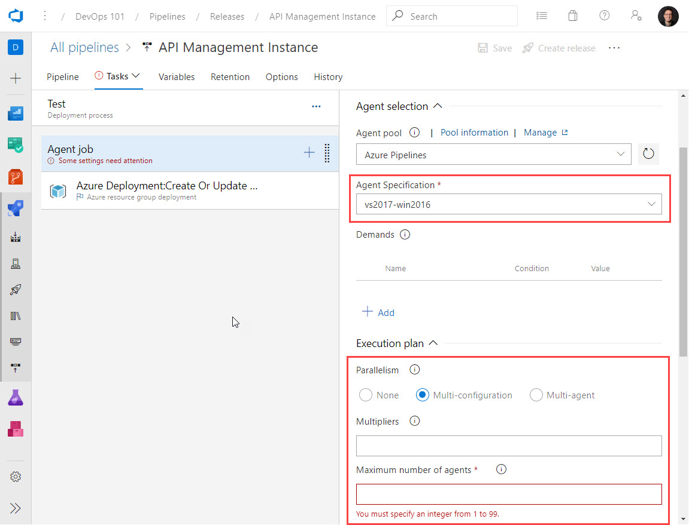

# Day 43 - Build Agents in Azure Pipelines

In this installment, we're going to begin unpacking build agents, your options, and where you can find advantages, both in terms of functionality and cost.

In this article:

[Hosting options](hosting-options) </br>
[Why self-hosted?](why-self-hosted) </br>
[Self-hosted agent flavors](Self-hosted-agent-flavors) </br>
[Why build agents on Docker?](why-build-agents-on-docker) </br>
[Custom Self-Hosted Build Agent Script (Linux VM)](custom-self-hosted-build-agent-script-linux-vm) </br>

## Hosting options

There are two hosting options for build agents:

- **Microsoft-hosted agents**, for which maintenance and upgrades are taken care of for you by Microsoft.
- **Self-hosted agents**, hosted by you, on premises or in your Azure subscription.

While you get one build agent as part of the base subscription (with 1800 minutes of build time per month), this won't be enough in terms of concurrency. For private projects, you'll get a single parallel job, you'll pay about $30/USD per month for each additional agent you add to your sub.

The parallelism options are there, but you have to take additional steps to make use of them.



**Figure 1**. Azure DevOps build agent settings

## Why self-hosted?

There are two primary reasons:

- **Flexibility**. Self-hosted agents give you more control to install dependent software needed for your builds and deployments.
- **Performance**. You can spin your agents up faster, reduce wait time, and machine-level caches and configuration persist from run to run, which can further boost speed.

Basically, if you need more control over the software installed on your build agents and greater control over performance and concurrency, self-hosted build agents can be an attractive alternative. Depending on how you manage your self-hosted agents, you may wind up saving money while gaining these benefits.

## Self-hosted agent flavors

There are a number of options available for running self hosted agents. You can run self-hosted agents on any of the following flavors:

- **Linux**. For tasks that require Linux, like bash scripts. Microsoft supports Ubuntu, Red Hat, and CentOS.
- **Windows**. For tasks that require a Windows build agent, like ARM template deployment with the [**Azure Resource Group Deployment**](https://docs.microsoft.com/en-us/azure/devops/pipelines/tasks/deploy/azure-resource-group-deployment?view=azure-devops#arguments) task.
- **macOS**. For jobs that need a macOS agent, like Xcode apps or Xamarin.iOS projects.
- **Docker**. You can run Linux or Windows-based agents, depending on the kind of builds you need. Linux is the default.

Because Docker give you greater density on your hosts, and the ability to customize your container images, it means you tackle concurrency and configuration flexibility more efficiently than you would with VMs.

You can find full details on self-hosted agent configuration [HERE](https://docs.microsoft.com/en-us/azure/devops/pipelines/agents/v2-linux?view=azure-devops).

## Why build agents on Docker?

- Deploy, destroy, and redeploy build agents rapidly
- Create new custom build agents without dirtying up the entire VM host
- Share images with others (via a container registry)

Docker and containers bring many of the same advantages to your build agents they bring to your applications.

## Custom Self-Hosted Build Agent Script (Linux VM)

Once you deploy your Linux VM with the software you need, you can deploy the Azure DevOps Linux agent. The script snippet below is provided here to show you how to install the agent with Bash. It's thoroughly commented so you know what's happening at each step of the process.

> **NOTE:** You can even incorporate your VM deployment and Azure DevOps agent configuration into a release pipelineso you can make this a hands-free process.

``` Bash
# Downloading AzureDevOps Linux Agent (2.142.1)
wget https://vstsagentpackage.azureedge.net/agent/2.142.1/vsts-agent-linux-x64-2.142.1.tar.gz \
-O $LINUX_USERNAME_HOME_DIR/vsts-agent-linux-x64-2.142.1.tar.gz

if [ $? -eq 0 ]; then
    echo "[$(date -u)][---info---] Downloaded Azure DevOps Linux Agent (2.142.1)." >> $CONFIG_AGENT_STATUS_LOG
else
    echo "[$(date -u)][---info---] Failed to download Azure DevOps Linux Agent (2.142.1)." >> $CONFIG_AGENT_STATUS_LOG
fi

# Extracting the AzureDevOps Linux Agent.
sudo -H -u $LINUX_USERNAME mkdir $LINUX_USERNAME_HOME_DIR/myagent && \
sudo -H -u $LINUX_USERNAME tar zxf $LINUX_USERNAME_HOME_DIR/vsts-agent-linux-x64-2.142.1.tar.gz -C $LINUX_USERNAME_HOME_DIR/myagent > $AGENT_INSTALLATION_LOG

if [ $? -eq 0 ]; then
    echo "[$(date -u)][---info---] Extracted the Azure DevOps Linux Agent to [$LINUX_USERNAME_HOME_DIR/myagent]." >> $CONFIG_AGENT_STATUS_LOG
else
    echo "[$(date -u)][---info---] Failed to extract the Azure DevOps Linux Agent to [$LINUX_USERNAME_HOME_DIR/myagent]." >> $CONFIG_AGENT_STATUS_LOG
fi

# Installing the AzureDevOps Linux Agent Dependencies.
sudo $LINUX_USERNAME_HOME_DIR/myagent/bin/installdependencies.sh > $AGENT_INSTALLATION_LOG

if [ $? -eq 0 ]; then
    echo "[$(date -u)][---info---] Installed the Azure DevOps Linux Agent Dependencies." >> $CONFIG_AGENT_STATUS_LOG
else
    echo "[$(date -u)][---info---] Failed to install the Azure DevOps Linux Agent Dependencies." >> $CONFIG_AGENT_STATUS_LOG
fi

# Changing over into the '$LINUX_USERNAME_HOME_DIR/myagent' directory.
cd $LINUX_USERNAME_HOME_DIR/myagent

if [ $? -eq 0 ]; then
    echo "[$(date -u)][---info---] Changed over to the [$LINUX_USERNAME_HOME_DIR/myagent] directory." >> $CONFIG_AGENT_STATUS_LOG
else
    echo "[$(date -u)][---info---] Failed to change over to the [$LINUX_USERNAME_HOME_DIR/myagent] directory." >> $CONFIG_AGENT_STATUS_LOG
fi

# Installing the AzureDevOps Linux Agent. 
sudo -H -u $LINUX_USERNAME ./config.sh \
--unattended \
--url "$AZURE_DEVOPS_URL" \
--auth pat \
--token "$AZURE_DEVOPS_PAT_TOKEN" \
--pool "$AZURE_DEVOPS_AGENT_POOL" \
--agent "$HOSTNAME" \
--acceptTeeEula > $AGENT_INSTALLATION_LOG

if [ $? -eq 0 ]; then
    echo "[$(date -u)][---info---] Installed the AzureDevOps Linux Agent" >> $CONFIG_AGENT_STATUS_LOG
else
    echo "[$(date -u)][---info---] Failed to install the AzureDevOps Linux Agent." >> $CONFIG_AGENT_STATUS_LOG
fi

# Installing the AzureDevOps Linux Agent Service. 
sudo ./svc.sh install >> $AGENT_INSTALLATION_LOG

if [ $? -eq 0 ]; then
    echo "[$(date -u)][---info---] Installed the AzureDevOps Linux Agent Service." >> $CONFIG_AGENT_STATUS_LOG
else
    echo "[$(date -u)][---info---] Failed to install the AzureDevOps Linux Agent Service." >> $CONFIG_AGENT_STATUS_LOG
fi

# Starting the AzureDevOps Linux Agent Service. 
sudo ./svc.sh start >> $AGENT_INSTALLATION_LOG

if [ $? -eq 0 ]; then
    echo "[$(date -u)][---info---] Started the AzureDevOps Linux Agent Service." >> $CONFIG_AGENT_STATUS_LOG
else
    echo "[$(date -u)][---info---] Failed to start the AzureDevOps Linux Agent Service." >> $CONFIG_AGENT_STATUS_LOG
fi
```

## Conclusion

As your DevOps practice grows, you will begin to care more about performance, parallelism, and managing costs. We hope this gets you started exploring your build options hands-on.