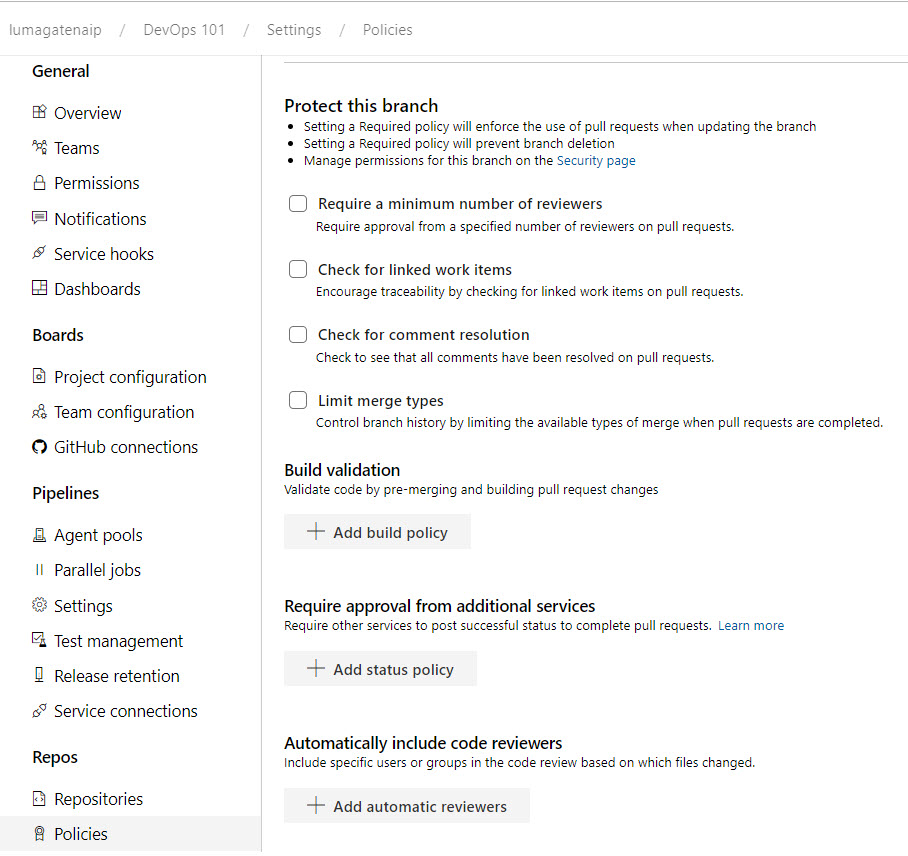
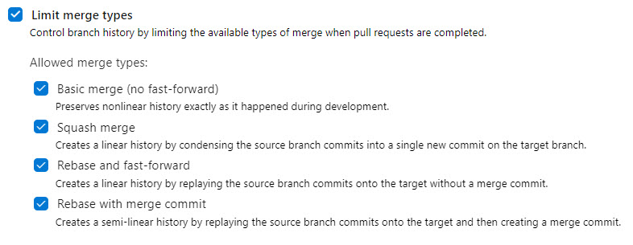
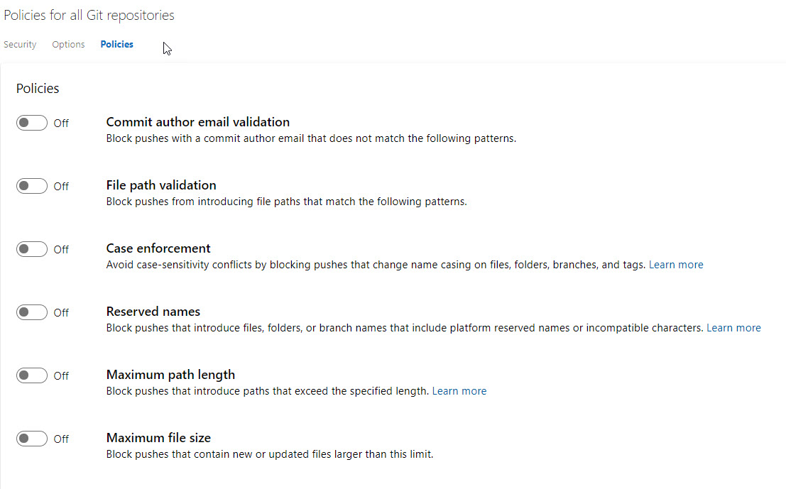

# Day 44 - Why should you move to Azure Repos?

Still using Bitbucket or Github for your production code that you build and release with Azure Pipelines? It's time to make a move to Azure Repos. Let me tell you the reasons why.

One thing that folks unfamiliar with Azure Repos seem to miss is that they are Git repos, so your code access,branching, and versioning don't need to change. It's business as usual. However, Azure Repos deliver a number of distinct advantages that help you better secure your code and automate enforcement of policies and best practices that make Azure Repos worth serious consideration.

Better quality, better security, enforcement of your standards, enhanced build automation, all with less work. This is good news for your DevOps evolution. Did I mention you  get unlimited private repos?

Other advantages worth exploring include:

[Tight Azure AD Integration](#tight-azure-ad-integration)  
[Flexible code views](#flexible-code-views)  
[Branch Policies](#branch-policies)  
[Branch Policy Bypass](#branch-policy-bypass)  
[Global policies for all repos](#global-policies-for-all-repos)  
[Simple Migration](#simple-migration)  

## Tight Azure AD Integration

Azure Repos includes native integration with Azure Active Directory (AD), which simplifies the process of managing code repo access. You can assign permissions and policies with Azure AD groups, just as you would resources in Azure. This means you can tie assignments, like who is a required code reviewer on a protected branch, to the Azure AD login they use every day.

You can protect your code and enforce practices that improve code quality, at both the repo and branch level at a granular level, including:

- Which users and groups can contribute and create branches
- Who can edit branch policies
- Check for comment resolution
- Who can/must review code

## Flexible code views

This is one of my favorite features. When viewing a commit, you can use the **side-by-side-diff** and **inline-diff** to see the code change from the perspective that most comfortable for you, including the entire file, not just the code that’s changed. In context, you can also collapse comments when you want to focus on the code changes.

## Branch Policies

Branch policies (Figure 1) give you ability to map your development policies to best practice and automate enforcement. There are quite a few built-in policies, including:

- Minimum number of code reviews
- Requiring successful builds
- Enforcing Git merge strategies (Figure 2), giving you control over your commit options, like basic, squash, rebase and fast-forward, rebase with merge.
- You also get flexible approval options, including requiring approval from additional services

**Figure 1**. Branch policies in Azure Repos

**Figure 2**. Limit merge types

### Build validation for PR processing

And **build validation**, a build policy which validates code submissions by pre-merging and building pull request changes is a great automation feature for processing pull requests. Setting your pull requests to auto-complete when the final status is successful is super handy, especially for those times you’re waiting on that final reviewer to approve.

## Branch Policy Bypass

The **bypass branch policies** option gives your developers  a "break glass” option when they have an urgent need to make a code change. This is a powerful feature, so you want to leverage the granular permissions in Azure Repos tied to your Azure AD users and groups to lock this down to a select group of folks.

## Global policies for all repos

Nothing is more annoying to my inner OCD than random file paths and poor case decisions on files (remember Linux is case sensitive!) just to name a couple. And issues like stepping on reserved names can have real consequences. This is where global policies that apply to all your Git repos in Azure Repos come in.

Currently, you can configure the following policies (Figure 3:)

- **Commit author email validation**. Block pushes with a commit author email that does not match the following patterns.

- **File path validation**. Block pushes from introducing file paths that match the following patterns.

- **Case enforcement**. Avoid case-sensitivity conflicts by blocking pushes that change name casing on files, folders, branches, and tags.

- **Reserved names**. Block pushes that introduce files, folders, or branch names that include platform reserved names or incompatible characters.

- **Maximum path length**. Block pushes that introduce paths that exceed the specified length.

- **Maximum file size**. Block pushes that contain new or updated files larger than this limit.

**Figure 3**. Policies for all Git repositories

## Simple Migration

You can import a report from [Github](https://docs.microsoft.com/en-us/azure/devops/repos/git/import-git-repository?view=azure-devops) or [Bitbucket](https://devblogs.microsoft.com/premier-developer/migrating-a-repo-from-bitbucket-to-azure-devops/) so easily, there is little excuse to delay the process. Click the links in the previous sentence to go right to the how-to you need.

## Conclusion

As you can see, there are multiple advantages in functionality, and likely in cost as well. More for less is a good combination as we try to automate, optimize, and conserve in our DevOps journey. If you haven't given Azure Repos a serious look, I hope this 5-minute read has changed your mind.
