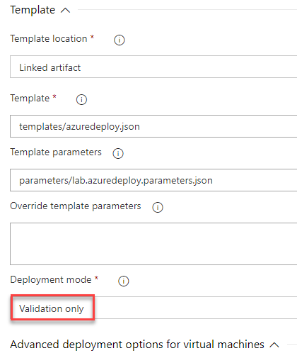
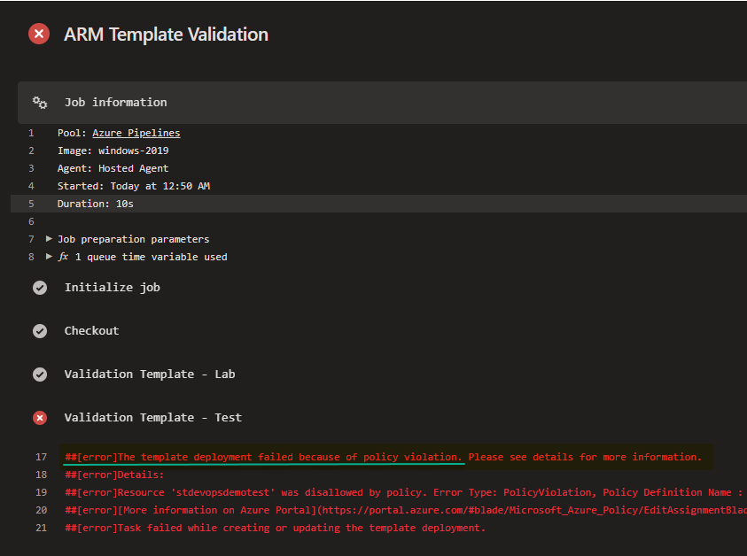
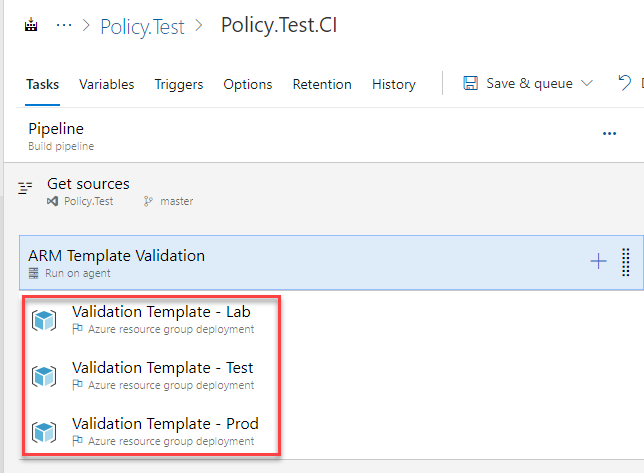
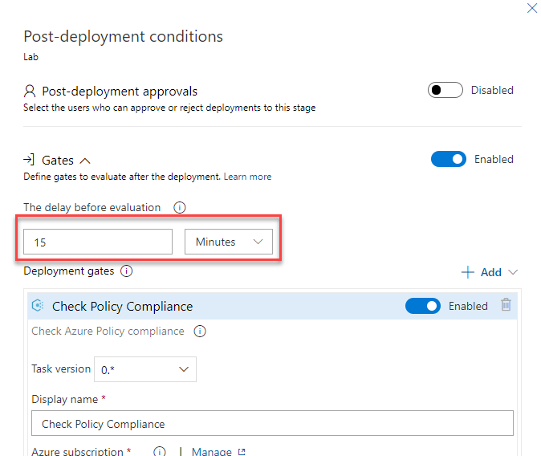

# Day 48 - Integrating Azure Policy Evaluations in Your Pipelines

*Today's post comes from guest contributor Tao Yang [@MrTaoYang](https://twitter.com/mrtaoyang). Tao is a Microsoft MVP who from 9-to-5 focuses on DevOps and governance in Azure for enterprise customers. You can find Tao blogging at [Managing Cloud and Datacenter by Tao Yang](https://blog.tyang.org/).*

Azure policy plays an important role in Azure cloud governance. You can configure Azure Policy to block or modify your original requests when deploying resources via Azure Resource Manager, or automatically kick off subsequent deployments after your original deployments if the resources you are deploying do not comply with the assigned policies. These behaviours can greatly impact your CI/CD pipelines. Today we are going to discuss how we can integrate Azure policy into our Azure DevOps pipelines.

**In this article:**

[Azure Policy Effects](#azure-policy-effects)  
[Policy Evaluation During Build and Test Stage](#policy-evaluation-during-build-and-test-stage)  
[Release Gate - Check Azure Policy compliance](#release-gate---check-azure-policy-compliance)  
[Conclusion](#conclusion)  

# Azure Policy Effects

The [***effect***](https://docs.microsoft.com/en-us/azure/governance/policy/concepts/effects?WT.mc_id=DOP-MVP-5000997) in an Azure Policy definition defines what actions to be taken when a non-compliant resource is detected. Although Azure Policy is equipped with many types of effects, we will focus on the following because they would have direct impact to your pipelines:
* **Append** - used to add additional fields to the requested resource during creation or update
* **Deny** - used to prevent a resource request that doesn't match defined standards through a policy definition and fails the request.
* **Modify** - used to add, update, or remove tags on a resource during creation or update.
* **DeployIfNotExists** - used to execute a template deployment when the condition is met.

# Policy Evaluation During Build and Test Stage

It is important to know the environments your pipeline is deploying to. For example, if you are deploying a public-facing storage account in your ARM template and there is an Azure Policy assigned to block any storage accounts that are not connected to a Service Endpoint in a VNet, your template deployment would fail because it would have been blocked by Azure Policy engine. In this case, it is important to detect such behaviour during build and test stage (or CI pipeline).

You can use the [***Azure resource group deployment***](https://docs.microsoft.com/en-us/azure/devops/pipelines/tasks/deploy/azure-resource-group-deployment?view=azure-devops&WT.mc_id=DOP-MVP-5000997) task to validate your template by using *Validation only* deployment mode (as shown below):

 

 Or if you are using YAML pipeline, the definition for this particular task looks like this:

 ~~~YAML
    - task: AzureResourceGroupDeployment@2
      displayName: 'Template Validation - Monitoring'
      inputs:
        azureSubscription: 'The-Big-MVP-Sub-1'
        resourceGroupName: '$(resourceGroup)'
        location: '$(location)'
        csmFile: templates/azuredeploy.json
        csmParametersFile: parameters/lab.azuredeploy.parameters.json
        overrideParameters: '-_artifactsLocation $(artifactsLocation) -_artifactsLocationSasToken $(artifactsLocationSasToken)'
        deploymentMode: Validation
 ~~~

If your template conflicts with Azure policy, the validation task will fail (as shown below):

 

>**IMPORTANT NOTE:** Although the same template would fail at the release stages for the same reason, it is important that we detect the failure at the build and test stage so release stages will never take place. This is because in addition to the ARM templates, you may have other additional tasks performed in the stage. You don't want to be in a situation that when a release is failed, you need to figure out a way to roll back all the tasks prior to deploying the failed ARM template.

When your pipeline is configured to deploy to multiple environments (i.e. dev, test, production), the Azure policies assigned to each environment may be different. For example, your organisation may allow large size VMs in production but not in dev and test. Therefore it is also important that you validate your templates against ***ALL*** environments that you are deploying to during build and test phase (as shown below). A test passed in dev and test doesn't mean it will be successfully deployed to production.

 

# Release Gate - Check Azure Policy compliance

>**NOTE:** At the time of writing this article, gates are only available in classic release pipelines. This feature is not yet avaiable for YAML pipelins at this stage.

We have already covered [Gates](https://docs.microsoft.com/en-us/azure/devops/pipelines/release/approvals/index?view=azure-devops&WT.mc_id=DOP-MVP-5000997) in various previous posts here. Microsoft offers a gate called [**Security and compliance assessment**](https://docs.microsoft.com/en-au/azure/devops/pipelines/policies/azure-policy?view=azure-devops&WT.mc_id=DOP-MVP-5000997). You can use this task to check the current compliance state of a subscription, a resource group or down to a specific resource. This task can be used as both pre and post deployment condition.

This task checks the overall policy compliance status for the specified target. You can use it as a pre-deployment gate and/or a post-deployment gate.

You use it as a pre-deployment gate to ensure the Azure environment you are deploying to is fully compliant from Policy point of view, and does not have any pre-existing non-compliant configurations (i.e. required tags are not configured). The release will only start if all the pre-deployment gates have passed. If the target subscription / resource group you are deploying to are not 100% compliant, the release will not start (as shown below):

 

When you have any policies with [***DeployIfNotExists***](https://docs.microsoft.com/en-us/azure/governance/policy/concepts/effects?WT.mc_id=DOP-MVP-5000997#deployifnotexists) effect assigned, Azure Policy may start additional template deployments. For example, you may have Azure Policies assigned to deploy Log Analytics agents after the VMs have been created, or configuring resource diagnostic settings. In scenarios like these, your release does not complete when your pipeline finishes running. Azure Policy would wait for approximately 10 minutes after the **start** of the initial ARM deployemnt (initiated by your pipeline in this case), and start additional deployment if required.

So it is very important that use post-deployment gate to check the overall compliance status of your target subscription / resource group - to ensure any subsequent policy-driven deployments have finished successfully. Frankly speaking, sometimes policy assignments get misconfigured, and do not always successfully complete the deployments - for example, if the Policy assignment Managed Identity does not have required permission to perform the deployment, it will fail, and your resources will be left as none-compliant.

>**NOTE:** When using this task as post-deployment gate, it is important that you configure enough time for delay before execution parameter (as shown below). The *DeployIfNotExists* policies will wait 10 minutes from the ***start*** of your ARM deployment before kicking off policy-initiated deployemtns. For example, if you yave started an ARM deployment to create a VM at 8:00am, and the deployment took 3 minutes (finished at 8:13am). The policy-initiated deployment will start approximately at 8:10am - which is 10 minutes after the start time of your deployment. Depending on what resources will Azure Policy deploy, you should have at least **15 minutes** delay for this post-deployment task.

 

# Conclusion

In this article, we have discussed how Azure Policy could interfere with your pipeline deployements, and what techniques you can adopt to ensure your pipeline plays nicely with the Azure Policies assigned to your environments.
