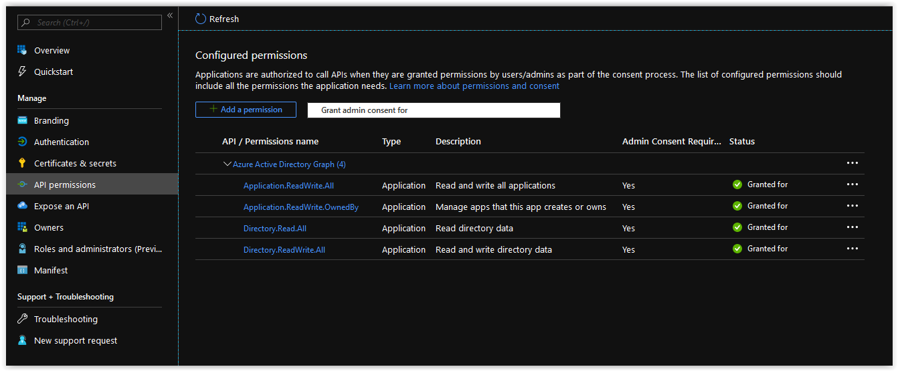

# Day 59 - One Service Principal to Rule Them All

In **[Day 4](./day.4.creating.a.service.principal.linux.in.plain.english.md)** we discussed how you may end up using Service Principals in Azure for things like Kubernetes, Ansible, and Custom Applications. While creating a single Service Principal is easy enough, trying to manage multiple Service Principals manually in an Azure Subscription can end up being quite cumbersome. Today we are going to discuss how you could use a single Azure Service Principal to manage all of your resources in Azure, including any additional Service Principals you may need.

In this article:

[Utility Extensions](#utility-extensions) </br>
[Azure CLI](#) </br>
[JSON](#json) </br>
[KUSTO](#kusto) </br>
[Python](#python) </br>
[PowerShell](#powershell) </br>

## The Omnipotent Service Principal

So you've tested out Kubernetes, Terraform, and Ansible in Azure. You're currently using three Separate Service Principals to manage them, but you don't have a programmatic way in place yet of deploying the Service Principals and their respective environments they are responsible for. This is something that can be put into place by using the paradigm shown in the diagram below.


</br>

Starting from the top of the diagram, we have a single Service Principal in place with Owner Rights across the entire Azure Subscription. This Service Principal is then used to create a Service Connection in Azure DevOps. From within Azure DevOps we can then create three separate build pipelines that are responsible for deploying Service Principals for Kubernetes, Terraform, and Ansible; along with their respective Resource Groups and the resources they contain.

</br>

## Permission Considerations

In order for a Service Principal to have the ability to create additional Service Principals in an Azure Subscription, it requires the following API permissions in Azure Active Directory Graph.

```text
Application.ReadWrite.All
Application.ReadWrite.OwnedBy
Directory.Read.All
Directory.ReadWrite.All
```

These permissions can be applied to a Service Principal either manually or by using the following JSON Template:

```json
[
    {
        "resourceAppId": "00000002-0000-0000-c000-000000000000",
        "resourceAccess": [
            {
                "id": "1cda74f2-2616-4834-b122-5cb1b07f8a59",
                "type": "Role"
            },
            {
                "id": "824c81eb-e3f8-4ee6-8f6d-de7f50d565b7",
                "type": "Role"
            },
            {
                "id": "5778995a-e1bf-45b8-affa-663a9f3f4d04",
                "type": "Role"
            },
            {
                "id": "78c8a3c8-a07e-4b9e-af1b-b5ccab50a175",
                "type": "Role"
            }
        ]
    }
]
```

</br>

From the Azure CLI, you can pass in this JSON Template as shown below.

```bash
az ad app update \
--id "http://mgmt-service-principal" \
--required-resource-accesses "./az-sub-mgmt-sp-manifest.json"
```

</br>

Lastly, you need to make sure to grant Admin Consent on the resource access definitions to the Azure App belonging to the Service Principal.

```bash
az ad app permission admin-consent \
--id "http://mgmt-service-principal"
```

</br>

When you are finished, the API permissions blade in your Service Principal should match what is shown below.



</br>

## Security Considerations

When creating your Management Service Principal, store the initial password that is generated at runtime in a variable and store it in a new or existing Azure Key Vault. Using this method will ensure the password will never appear anywhere in your code in clear text and can only be accessed from individuals or services with access to the Key Vault it's stored in.

If, for whatever reason, the Management Service Principal is compromised, there are two primary options to consider

* Delete the Management Service Principal and re-create it.
* Reset the Password on the Management Service Principal.

If you have scripted the creation of the Management Service Principal, deleting it and it's associated Key Vault/Secret would be the quickest solution.

> **NOTE:** If you do have to re-create your Management Service Principal, don't forget to update any related Service Connections in Azure DevOps.

</br>

## Conclusion

In today's article we discussed how you could use a single Service Principal to manage all of your Resources in an Azure Subscription. If there's a specific scenario that you wish to be covered in future articles, please create a **[New Issue](https://github.com/starkfell/100DaysOfIaC/issues)** in the [starkfell/100DaysOfIaC](https://github.com/starkfell/100DaysOfIaC/) GitHub repository.
