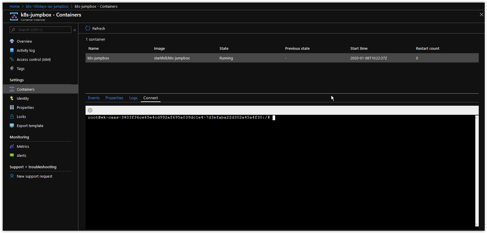

# Day 74 - Deploying a Private Kubernetes Cluster in Azure - Part 3

*This is the third in a series of posts on deploying and managing a Private Kubernetes Cluster in Azure.*

***[Day 71 - The Current State of Kubernetes in Azure](./day.71.the.current.state.of.k8s.in.azure.md)***</br>
***[Day 72 - Deploying a Private Kubernetes Cluster in Azure - Part 1](./day.72.deploying.private.k8s.clusters.in.azure.001.md)***</br>
***[Day 73 - Deploying a Private Kubernetes Cluster in Azure - Part 2](./day.73.deploying.private.k8s.clusters.in.azure.002.md)***</br>
***[Day 74 - Deploying a Private Kubernetes Cluster in Azure - Part 3](./day.74.deploying.private.k8s.clusters.in.azure.003.md)***</br>

</br>

In today's article we will cover how to access the Private Kubernetes Cluster using an Azure Container Instance.

[Creating the AKS-Engine Cluster Definition](#creating-the-aks-engine-cluster-definition)</br>
[Options for connecting to a Private Kubernetes Cluster](#options-for-connecting-to-a-private-kubernetes-cluster)</br>
[Deploy a new Subnet in the Kubernetes VNet](#deploy-a-new-subnet-in-the-kubernetes-vnet)</br>
[Things to Consider](#things-to-consider)</br>
[Conclusion](#conclusion)</br>

## Options for connecting to a Private Kubernetes Cluster

The Microsoft recommended way of accessing Private Kubernetes Cluster, is to deploy a VM that is either on the same VNet as the Cluster or in a different VNet that is peered with the VNet that the Cluster is in.

Instead of using a VM, we are going to add a new Subnet in the existing Kubernetes Cluster VNet and then deploy an Azure Container Instance running a container image with **kubectl** already installed. Additionally, the variable values from **[Part 1](./day.72.deploying.private.k8s.clusters.in.azure.001.md)** will be populated to the secured environment variables of the container at runtime which we will use to connect to the K8s Master Node and copy its kubeconfig file to the container, and then use it to connect to the Kubernetes Cluster.

</br>

## Deploy a new Subnet in the Kubernetes VNet

Retrieve the current name of the existing Kubernetes Cluster VNet.

```bash
K8S_VNET_NAME=$(az network vnet list \
--resource-group k8s-100days-iac \
--query [].name \
--output tsv)
```

Next, run the following command to deploy a new Subnet for the Kubernetes Jumpbox Container in the VNet called **jumpbox-subnet**.

```bash
DEPLOY_JUMPBOX_SUBNET=$(az network vnet subnet create \
--name jumpbox-subnet \
--vnet-name $K8S_VNET_NAME \
--resource-group k8s-100days-iac \
--address-prefixes 10.239.1.0/24)
```

Next, run the following command to verify that the Subnet was deployed successfully.

```bash
echo $DEPLOY_JUMPBOX_SUBNET | jq .provisioningState
```

You should get back the following response.

```console
"Succeeded"
```

</br>

## Retrieve the IDs of the Private Kubernetes Cluster VNet and the new Subnet

Next, run the following command to retrieve the ID of the Private Kubernetes Cluster VNet.

```bash
K8S_VNET_ID=$(az network vnet list \
--resource-group k8s-100days-iac \
--query [].id \
--output tsv)
```

Next, run the following command to retrieve the ID of **jumpbox-subnet**.

```bash
K8S_JUMPBOX_SUBNET_ID=$(echo $DEPLOY_JUMPBOX_SUBNET | jq .id | tr -d '"')
```

</br>

## Deploy a new Resource Group for the Kubernetes Jumpbox Container

Run the following command to deploy a new Resource Group for the Kubernetes Jumpbox Container

```bash
/usr/bin/az group create \
--name "k8s-100days-iac-jumpbox" \
--location "westeurope"
```

</br>

You should get back the following output.

```json
{
  "id": "/subscriptions/00000000-0000-0000-0000-000000000000/resourceGroups/k8s-100days-iac-jumpbox",
  "location": "westeurope",
  "managedBy": null,
  "name": "k8s-100days-iac-jumpbox",
  "properties": {
    "provisioningState": "Succeeded"
  },
  "tags": null,
  "type": "Microsoft.Resources/resourceGroups"
}
```

</br>

## Deploying the Kubernetes Jumpbox Container

Next, run the following command to deploy an Azure Container Instance to connecting to the Kubernetes Cluster.

```bash
az container create \
--name k8s-jumpbox \
--resource-group k8s-100days-iac-jumpbox \
--image starkfell/k8s-jumpbox \
--ip-address private \
--vnet $K8S_VNET_ID \
--subnet $K8S_JUMPBOX_SUBNET_ID \
--secure-environment-variables \
"SSH_KEY_PASSWORD"="$SSH_KEY_PASSWORD" \
"K8S_SSH_PRIVATE_KEY"="$SSH_PRIVATE_KEY" \
"K8S_SSH_PRIVATE_KEY_NAME"="k8s-100days-iac-${RANDOM_ALPHA}"
```

</br>

The Container will take a couple of minutes to deploy and should showing a state of **- Running ..**. Once it's finished deploying, you should the following at the bottom of the output.

```json
  "osType": "Linux",
  "provisioningState": "Succeeded",
  "resourceGroup": "k8s-100days-iac-jumpbox",
  "restartPolicy": "Always",
  "tags": {},
  "type": "Microsoft.ContainerInstance/containerGroups",
  "volumes": null
}
```

</br>

## Connect to the Kubernetes Jumpbox Container in the Azure Portal

Next, open up a web browser and login to the Azure Portal(). Browse to **Resource Group** --> k8s-100days-iac-jumpbox and then click on the Azure Container Instance, k8s-jumpbox. Next, under Settings, click on Containers and then click on the **Connect** Tab. You will be prompted to **Choose Start Up Command**, select **/bin/bash** and then click on the **Connect** button. Your view should be similar to what is shown below.



Run the rest of the instructions that follow in the Console of the Jumpbox Container which can be copy and pasted into it.

</br>

Next, run following command to **echo** out the SSH Private Key to a file from it's environment variable on the Azure Container Instance.

```bash
echo "$K8S_SSH_PRIVATE_KEY" > $K8S_SSH_PRIVATE_KEY_NAME && \
chmod 0600 $K8S_SSH_PRIVATE_KEY_NAME
```

</br>

Next, run the following command to retrieve the Master kubeconfig File from the Kubernetes Master Host.

```bash
sshpass -P "pass" \
-p $SSH_KEY_PASSWORD /usr/bin/scp \
-o "StrictHostKeyChecking=no" \
-o "UserKnownHostsFile=/dev/null" \
-i "$K8S_SSH_PRIVATE_KEY_NAME" \
linuxadmin@10.255.255.5:/home/linuxadmin/.kube/config master-kubeconfig
```

You should get back the following response.

```console
Warning: Permanently added '10.255.255.5' (ECDSA) to the list of known hosts.

Authorized uses only. All activity may be monitored and reported.
```

</br>

Next, run the following command to set **kubectl** to target the Private Kubernetes Cluster.

```bash
export KUBECONFIG=./master-kubeconfig
```

</br>

Next, run the following command to verify you can connect to the Cluster.

```bash
kubectl cluster-info
```

You should get back the following output.

```c
Kubernetes master is running at https://10.255.255.5:443
CoreDNS is running at https://10.255.255.5:443/api/v1/namespaces/kube-system/services/kube-dns:dns/proxy
kubernetes-dashboard is running at https://10.255.255.5:443/api/v1/namespaces/kube-system/services/https:kubernetes-dashboard:/proxy
Metrics-server is running at https://10.255.255.5:443/api/v1/namespaces/kube-system/services/https:metrics-server:/proxy

To further debug and diagnose cluster problems, use 'kubectl cluster-info dump'.
```

</br>

## Things to Consider

If you are deploying a Private Kubernetes Cluster into an existing VNet, the Kubernetes API Endpoint IP Address will be something other than 10.255.255.5.


</br>

## Conclusion

In today's article we deployed a new Private Kubernetes Cluster in Azure using AKS-Engine. If there's a specific scenario that you wish to be covered in future articles, please create a **[New Issue](https://github.com/starkfell/100DaysOfIaC/issues)** in the [starkfell/100DaysOfIaC](https://github.com/starkfell/100DaysOfIaC/) GitHub repository.
