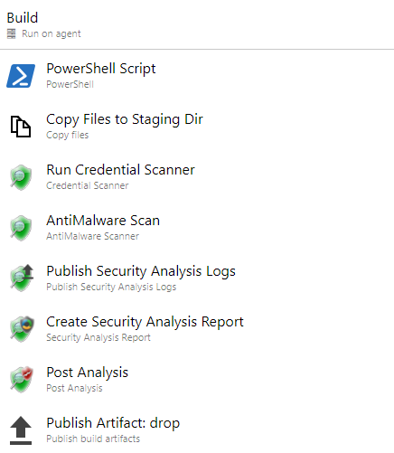
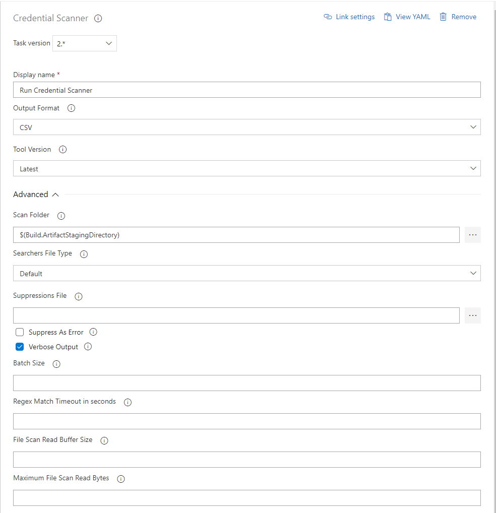
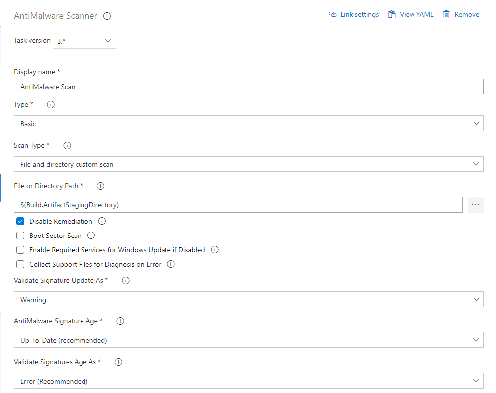
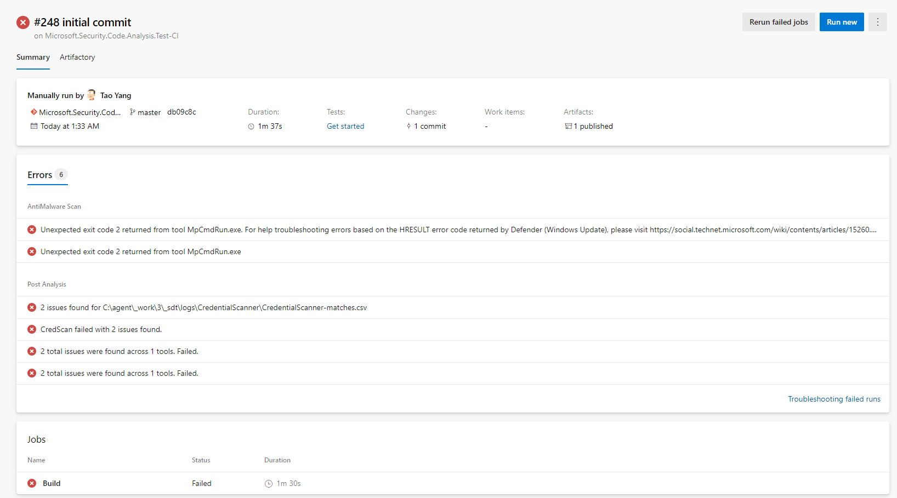
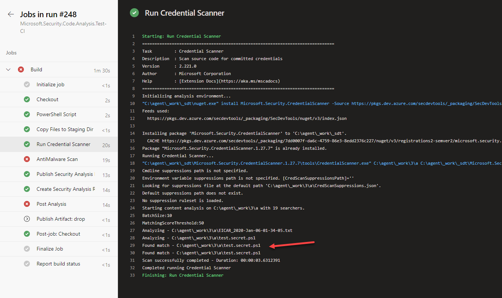
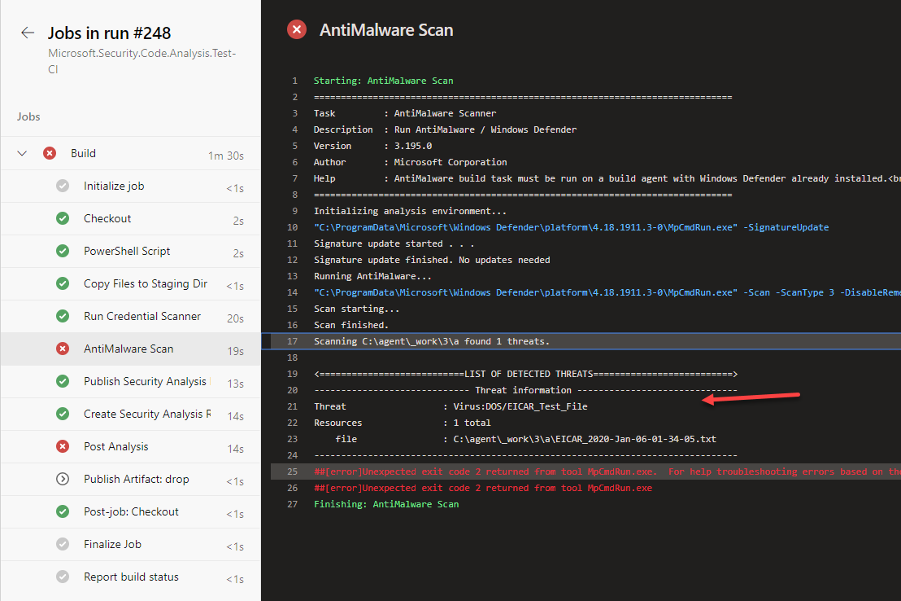
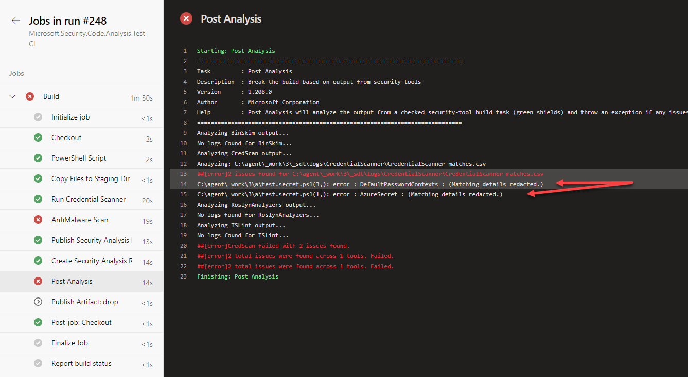
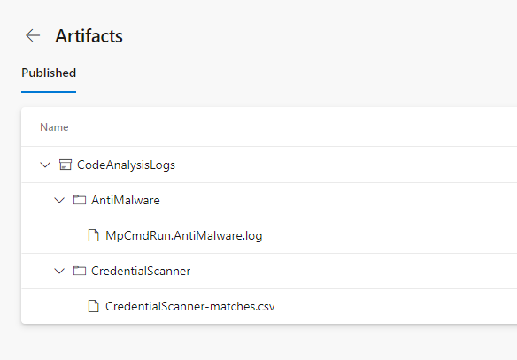

# Day 77 - Azure DevOps Security Code Analysis Extension

*Today's post comes from guest contributor Tao Yang [@MrTaoYang](https://twitter.com/mrtaoyang). Tao is a Microsoft MVP who from 9-to-5 focuses on DevOps and governance in Azure for enterprise customers. You can find Tao blogging at [Managing Cloud and Datacenter by Tao Yang](https://blog.tyang.org/).*


## Introduction

When developing your Infrastructure as Code projects, it is important that your source code and artifacts do not contain security risks such as keys, secrets, passwords, or even virus. It is important that you have the ability to detect these risks before been deployed.

Microsoft recently GA'd a toolset called [Microsoft Security Code Analysis](https://secdevtools.azurewebsites.net/).

With the Microsoft Security Code Analysis (MSCA) extension, you can add security code analysis tasks to your Azure DevOps pipelines. This analysis is recommended by the Secure Development Lifecycle (SDL) experts at Microsoft. You can learn more about this toolset at [Microsoft's documentation site](https://docs.microsoft.com/en-us/azure/security/develop/security-code-analysis-overview?WT.mc_id=DOP-MVP-5000997).

MSCA comes with the following tasks:

* **Anti-Malware Scan:** Run Defender on your build artifacts
* **BinSkim:** Validates compiler settings, linker settings, and other security-relevant characteristics of binary files
* **Credential Scanner:** Detects credentials, secrets, certificates, and other sensitive content in your source code and your build output.
* **Microsoft Security Risk Detection:** Microsoft Security Risk Detection (MSRD) is a cloud-based service for fuzz testing. It identifies exploitable security bugs in software.
* **Roslyn Analyzer:** Roslyn Analyzers is Microsoft's compiler-integrated tool for statically analyzing managed C# and Visual Basic code.
* **TSLint for Windows:** checks TypeScript code for readability, maintainability, and errors in functionality.

It also comes with the following post-processing and reporting tasks:

* **Publish Security Analysis Logs**: Preserves the log files generated by the security tools that are run during the build.
* **Security Analysis Report:** Parses the log files generated by the security tools that are run during the build.
* **Post-Analysis:** Causes the build to fail if one or more analysis tools report issues in the code.

Since the topic of this project is Infrastructure as Code in Azure, some of the above listed tasks may not apply here. However, tasks such as **Anti-Malware Scan** and **Credential Scanner** are particularly useful in this context.

I'm going to demonstrate how I've used **Anti-Malware Scan** and **Credential Scanner** tasks to detect security risks in a demo pipeline.

## Demonstration



>**Note:** Based on my testing, the Anti-Malware Scan task only works on self-hosted agents running on Windows VMs. Therefore, This demo pipeline is configured to run on a self-hosted agent queue.

This demo pipeline contains the following steps:

1. **PowerShell Script** - Execute a [script](https://gist.github.com/tyconsulting/d58316fafb1ee769039f52eddd6de5e7) that creates a [EICAR test virus file](https://en.wikipedia.org/wiki/EICAR_test_file) to the build artifact staging directory.

2. **Copy File to Staging Dir** - Copying a PowerShell script (as shown below) that contains some sensitive data such as key, user name and plain text password to the build artifact staging directory.

```PowerShell
$key = 'pwi4dHBf88nb01O4nVv0YAqyEUF8IWTe6daS3MkeRs39fqSu950Yiv4gbX4GvcSTSZFtlCITpEX4gQxH9849uA=='
$username = 'admin'
$password = 'gmBxMWnbSUgPF!4s@WV6'
$secPw = ConvertTo-SecureString -String $password -AsPlainText -Force
$cred = new-object System.Management.Automation.PSCredential($username, $secPw)
```
3. **Run Credential Scanner** - Run Cred Scan against the build artifact staging directory


4. **AntiMalware Scan** - Scan the build artifact staging directory.


5. **Publish Security Analysis Logs**
6. **Create Security Analysis Report**
7. **Post Analysis** - This is to fail the pipeline if either the AntiMalware or the credential scan has detected issues
8. Publish Artifacts

As you can see, the PowerShell script in step 1 creates a virus, and another script contains sensitive information. Therefore, both AntiMalware scan and credential scan should detect these issues. When I run the pipeline, it should fail (and it did):

Pipeline Summary:


Credential Scan Result:


AntiMalware Scan Result:


Post Analysis Result


Logs published as build artifact:



## How to Obtain the Microsoft Security Code Analysis Extension

The MSCA extension is not free. Microsoft charges a flat rate per Azure DevOps instance. To obtain it, you will need to contact Microsoft directly. Please refer to the [onboarding documentation](https://docs.microsoft.com/en-us/azure/security/develop/security-code-analysis-onboard?WT.mc_id=DOP-MVP-5000997) for more details.

Although I can't disclose the exact price here, but in my opinion, the price is very competitive. It should be a no brainer. In the end, it's hard to put a price on (lack of) security.

## Conclusion

In this post, I have demonstrated how to leverage the Microsoft Security Code Analysis extension to scan for security risks and vulnerabilities as part of your build pipeline. Security is important for every organization. You will need to make sure you have a good solution in place that prevents sensitive information been stored in Git repository, and stop malicious artifacts from being deployed to your cloud environments.
