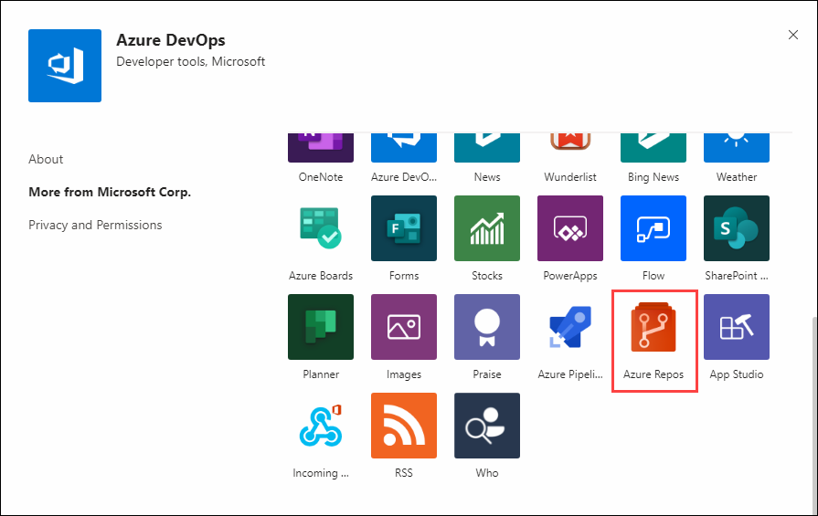
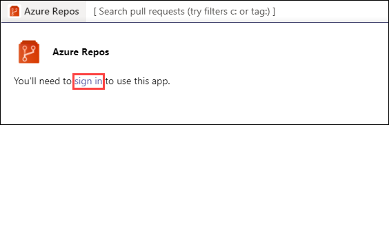
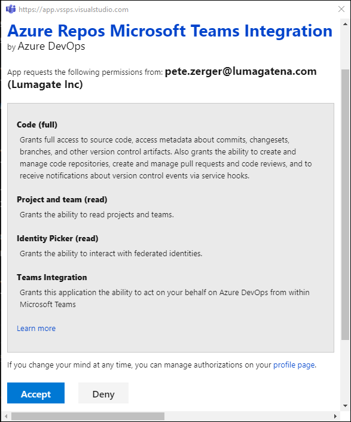
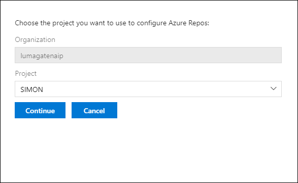
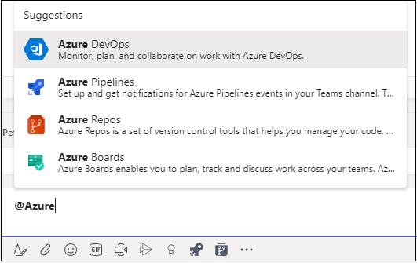
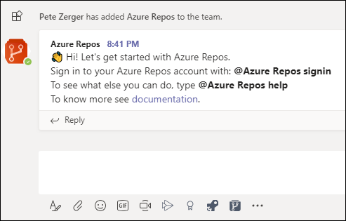

# Day 80 - Azure DevOps Integration with Microsoft Teams - Part 3

In Day 79, we delved further Azure DevOps integration with Microsoft Teams, focusing on Azure Pipelines, adding a tab to display a Dashboard, and then looking into our releases, and release notifications. Today, we'll finish our tour of Teams integration in Azure DevOps with a brief look at Teams integration with Azure Repos.

Here are the previous installments in this series. If you haven't read them, take 10 minutes and check them out:
[Day 78 - Azure DevOps Integration with Microsoft Teams - Part 1](https://github.com/starkfell/100DaysOfIaC/blob/master/articles/day.78.AZDO-Teams-Integrate.md)
[Day 79 - Azure DevOps Integration with Microsoft Teams - Part 2](https://github.com/starkfell/100DaysOfIaC/blob/master/articles/day.78.AZDO-Teams-Integrate-Pt2.md)

Today, I'll start by selecting my Team in Microsoft Teams, click the ellipsis (...), and find the existing Azure DevOps app I added in Day 78. I'll find it on the Apps tab, as shown in Figure 1.

**Figure 1**. The Azure DevOps app in Teams

To enable integration with Azure Repos, I'll click on Azure DevOps, and then choose Azure Repos from the list of apps, shown in Figure 2. Click add to add the Azure Repos app to Teams.

**Figure 2**. Azure Repos app in Teams

The Azure Repos app brings your Azure Repos life into Teams, allowing you to monitor activities in your repositories, search and share pull requests with your colleagues and get previews of pull requests using URLs.

Upon adding the app, you'll notice Azure Repos in the search box at the top of your Teams client. When you click on the search box, you'll see a message that you need to authenticate to Azure Repos to use this functionality, as shown in Figure 3.

**Figure 3**. Azure Repos app authentication prompt in Teams

After you sign in, you'll be prompted to provide consent for the app to access various aspects of your Azure Repos, detailed in the consent dialog shown in Figure 4.

**Figure 4**. Consent dialog for Azure Repos app in Teams 

Next, you'll be prompted to choose the Org and Project in Azure DevOps, as shown in Figure 5. At this point, you'll be able to use search to review your active pull requests (PRs). Should you work with multiple projects day-to-day, you can change this pretty easily each time you use the extension, and get notifications from PRs in multiple projects.

**Figure 5**. Org and Project prompt for Azure Repos app

If I move down to the chat interface and start typing **@Azure**, I'll get the list of Azure DevOps components I can interact with through the bot, which includes Azure Repos, as shown in Figure 6.

**Figure 6**. Azure DevOps bot experience in Teams

You'll get a welcome message with a login request and a documentation link, shown in Figure 7.   Set up and manage subscriptions to receive notifications in your channel whenever code is pushed/checked in or when a pull request (PR) is created, updated or merged.

So as you can see, Azure Repos integration with Teams is very focused on code updates (PRs), so this is great for getting notifications for activities that count without having to fish them from a busy email inbox.

## Conclusion

That's it for Teams integration with Azure DevOps. As you can see, Teams can really enhance the DevOps experience for your Infrastructure-as-Code life, reducing your context switching between apps and portals and other tools. If you haven't tried the Azure DevOps app for Teams, you should absolutely go back to Day 78 (the beginning of this mini-series) and get your boards, pipelines, and repos talking to Teams, saving trips to the portal and Outlook. Enjoy!

Have a topic you'd like us to cover that you haven't seen yet? Open an issue on the 100 Days repo and we'll do our best!