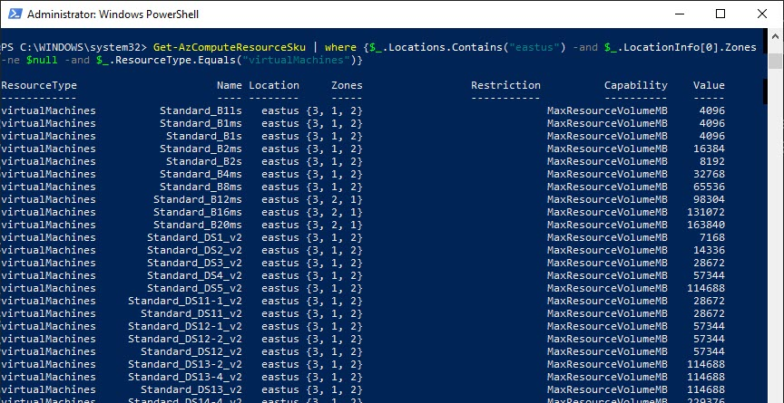

# Day 83 - HA for VMs with Availability Zones in ARM

Today, we're going to take a look at another high availability option for Azure VMs - Availability Zones. We'll quickly discuss

## What are Availability Zones?

Availability Zones are unique physical locations within an Azure region. Each zone is made up of one or more datacenters equipped with independent power, cooling, and networking. To ensure resiliency, there’s a minimum of three separate zones in all enabled regions.

## ## How do they work?

An Availability Zone in an Azure region is a combination of a fault domain and an update domain. For example, if you create three or more VMs across three zones in an Azure region, your VMs are effectively distributed across three fault domains and three update domains. The Azure platform recognizes this distribution across update domains to make sure that VMs in different zones

- **Zonal services** – you pin the resource to a specific zone (e.g. VMs, managed disks, Standard IPs, etc.) OR
- **Zone-redundant services** – platform replicates automatically across zones (for example, zone-redundant storage, SQL Database).

## Availability Set vs Availability Zone

A group with two or more VMs in the same datacenter is called an **Availability Set**, which ensures that at least one of the VMs hosted on Azure will be available if something happens. This configuration offers 99.95% SLA. We can configure an availability set ONLY when we deploy a new VM. We can't add an existing VM.

Conveniently, we created an ARM template that deploys three VMs in an availability set in [Day 47](https://github.com/starkfell/100DaysOfIaC/blob/master/articles/day.47.deploy.mult.res.arm.md), so you can find a working example there.

**Availability Zones** are the next level in VM high-availability, because the VMs are in different physical locations within an Azure Region. It can be deployed using one or more Virtual Machines in an Azure Region.  Availability zones offer 99.99% SLA. Availability Zones don't support all VM sizes, but can check what SKUs are supported with a quick PowerShell command:

``` PowerShell
Connect-AzAccount

# Change to the desired target sub
$GetSub = Get-AzSubscription -SubscriptionId <subscription guid>
Select-AzSubscription -SubscriptionObject $GetSub

# Enumerate VM SKUs that support availability zones
Get-AzComputeResourceSku | where {$_.Locations.Contains("eastus") `
                                -and $_.LocationInfo[0].Zones -ne $null `
                                -and $_.ResourceType.Equals("virtualMachines")}
```

The output is shown in Figure 1 below.



**Figure 1**. Output of PowerShell to enumerate VM SKUs that support availability zones

## EXAMPLE: Adding Availability Zones to VM deployment

Here is the ARM template from day 47, updated to use availability zones instead of availability sets. You'll also find a copy in the [day83](../resources/day83) resources folder.

## Conclusion

Availability zones may not be a feature you will use every day, but definitely worth having another option in your arsenal. Give it a try and ping us back with questions on the 100 Days repo.

Have a topic you'd like us to cover that you haven't seen yet? Open an issue on the 100 Days repo and we'll do our best!