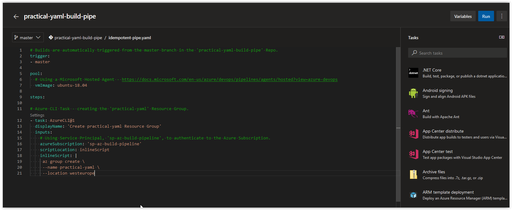

# Day XX - Practical Guide for YAML Build Pipelines in Azure DevOps - Part 2

*This is the second post on how to build your Azure DevOps Pipeline using YAML. If you haven't read **[Part 1](./day.35.building.a.practical.yaml.pipeline.part.1.md)** already, start there first.*

Today, we are going to take you through the process of setting up a Build Pipeline as Code using YAML in Azure DevOps. In future installments, we will continue to build on the content used in this article.

**In this article:**

[Deploy an Azure Container Registry]()</br>
[Grant the Service Principal access to the Azure Container Registry]()</br>
[Conclusion](#conclusion)</br>

## Deploy an Azure Container Registry

In Azure DevOps, open up the **practical-yaml-build-pipe** Build Pipeline and put it in Edit mode. You'll notice that you have Tasks that are available to you on the right side of the screen that you can use as templates in the **idempotent-pipe.yaml** file.



</br>

Add in the following code to the **idempotent-pipe.yaml** file.

> **NOTE:** Replace all instances of **pracazconreg** with a unique name or append some alphanumeric characters after it; otherwise, you'll be trying to deploy to an Azure Container Registry that already exists...sorry, I used it first!

</br>

```yaml
# Azure CLI Task - creating the 'pracazconreg' Azure Container Registry.
- task: AzureCLI@1
  displayName: 'Create pracazconreg Azure Container Registry'
  inputs:
    # Using Service Principal, 'sp-az-build-pipeline', to authenticate to the Azure Subscription.
    azureSubscription: 'sp-az-build-pipeline'
    scriptLocation: inlineScript
    inlineScript: |
    az acr create \
    --name pracazconreg \
    --resource-group practical-yaml \
    --sku Basic
```

</br>

The **idempotent-pipe.yaml** file should now match what is shown below.

```yaml
# Builds are automatically triggered from the master branch in the 'practical-yaml-build-pipe' Repo.
trigger:
- master

pool:
  # Using a Microsoft Hosted Agent - https://docs.microsoft.com/en-us/azure/devops/pipelines/agents/hosted?view=azure-devops
  vmImage: ubuntu-18.04

steps:

# Azure CLI Task - creating the 'practical-yaml' Resource Group.
- task: AzureCLI@1
  displayName: 'Create practical-yaml Resource Group'
  inputs:
    # Using Service Principal, 'sp-az-build-pipeline', to authenticate to the Azure Subscription.
    azureSubscription: 'sp-az-build-pipeline'
    scriptLocation: inlineScript
    inlineScript: |
     az group create \
     --name practical-yaml \
     --location westeurope

# Azure CLI Task - creating the 'pracazconreg' Azure Container Registry.
- task: AzureCLI@1
  displayName: 'Create pracazconreg Azure Container Registry'
  inputs:
    # Using Service Principal, 'sp-az-build-pipeline', to authenticate to the Azure Subscription.
    azureSubscription: 'sp-az-build-pipeline'
    scriptLocation: inlineScript
    inlineScript: |
     az acr create \
     --name pracazconreg \
     --resource-group practical-yaml \
     --sku Basic
```

</br>

Click on the **Save** button on the top right of the page to commit the change to the **master** branch. The Build Pipeline will immediately kick-off and should complete in about a minute.

In the Job log, you should see the successful deployment of the Azure Container Registry as shown below. Additionally, if you look in the Azure Portal, you should see the Azure Container Registry located in the **practical-yaml** Resource Group.


</br>

## Grant the Service Principal access to the Azure Container Registry

```yaml
# Azure CLI Task - Grant Contributor Rights to ACR 'pracazconreg' for Service Principal 'sp-az-build-pipeline-creds'.
- task: AzureCLI@1
  displayName: 'Grant Access to ACR'
  inputs:
    # Using Service Principal, 'sp-az-build-pipeline', to authenticate to the Azure Subscription.
    azureSubscription: 'sp-az-build-pipeline'
    scriptLocation: inlineScript
    inlineScript: |
     ACR_REGISTRY_ID=$(az acr show \
     --name pracazconreg \
     --query id \
     --output tsv)

     SP_APP_ID=$(az ad sp show \
     --id http://sp-az-build-pipeline-creds \
     --query appId \
     --output tsv)

     az role assignment create \
     --assignee $SP_APP_ID \
     --scope $ACR_REGISTRY_ID \
     --role Contributor
```

## Conclusion

In today's article, we created a Build Pipeline as Code using YAML in Azure DevOps that created an empty Resource Group that we will deploy resources to in future installments of this series of blog posts. If there's a specific scenario that you wish to be covered in future articles, please create a **[New Issue](https://github.com/starkfell/100DaysOfIaC/issues)** in the [starkfell/100DaysOfIaC](https://github.com/starkfell/100DaysOfIaC/) GitHub repository.
